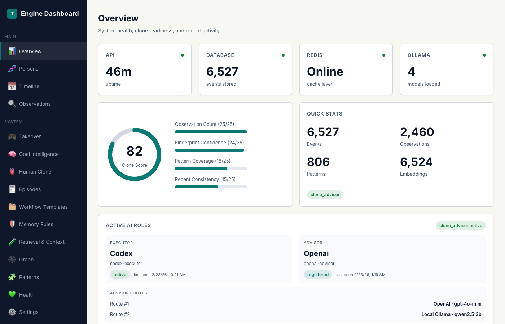
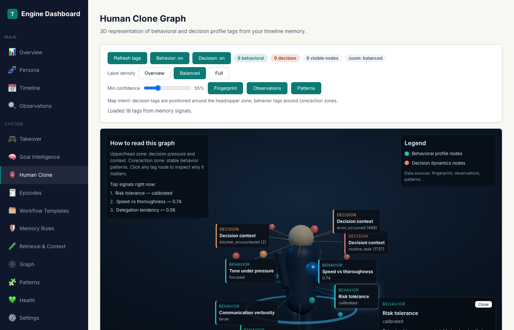
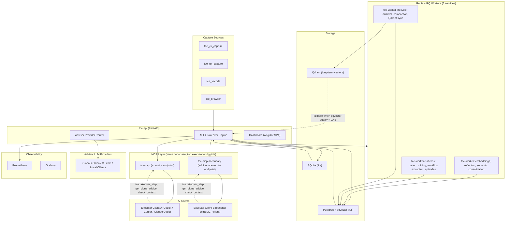

<p align="center">
  
</p>

<h1 align="center">Open Timeline Engine</h1>

<p align="center"><strong>Give your AI agents a shared memory — and your judgment.</strong></p>

<p align="center">
  <a href=".github/workflows/ci.yml"></a>
  <a href="LICENSE"></a>
  <a href="docs/releases.md"></a>
  <a href="https://www.python.org/"></a>
  <a href="infra/docker-compose.yml"></a>
</p>

> Public release track: `v0.3.0` (pre-1.0).
> Internal labels such as `V4`–`V9.6` are architecture milestones, not public release numbers.

> ⚠️ **Experimental Project** — This is a personal research experiment and is **not production-ready**. APIs, storage formats, and behavior may change without notice. Use at your own risk.

## What this is (30 seconds)

Open Timeline Engine (TCE) is a local-first context platform that captures your real workflow over time, mines repeatable patterns, and serves them back to AI agents with citations, policy enforcement, and auditability.

> Naming note: `TCE` is the original internal shorthand for **Timeline Context Engine**. Public project name is **Open Timeline Engine**.

### What problem this solves

Every AI coding session starts from zero. You explain the same conventions, re-describe the same architecture, and watch the agent repeat mistakes you corrected yesterday. The more you use AI agents, the more this hurts:

| Without TCE | With TCE |
| --- | --- |
| Agent forgets your last 50 sessions | Persistent memory across every session — events, patterns, episodes, rules |
| Same mistake repeated in different words | Past decisions surfaced with citations before the agent acts |
| No guard rails on destructive actions | Safety lifecycle: `permit → claim → execute → report` |
| Context window is the only memory | Thousands of searchable, scoped observations with retrieval ranking |
| Each executor is isolated | Shared or per-executor memory — Codex learns what Claude discovered |
| You are the only quality gate | Advisor AI audits executor behavior against your learned working style |

### Who this is for

- **Repeat users of AI coding agents** — if you use Codex, Claude, or Cursor on the same codebase daily, TCE compounds what they learn.
- **Solo developers who want accountability** — auditable timeline of what the AI did, why, and what it was told not to do.
- **Anyone who wants local control** — your data stays on your machine, you pick the providers, you set the policy.

### What you get in one session

1. Connect any MCP-compatible executor (Codex, Claude Desktop, Cursor).
2. Activate takeover — TCE tracks the objective, enforces safety gates, and records outcomes.
3. Next session starts with relevant memory instead of a cold prompt.

Use it in two ways:
- `timeline_only`: searchable timeline, patterns, graph context, and summaries.
- `clone_advisor`: dual-AI mode where an advisor model enforces your learned working style.

<table align="center">
  <tr>
    <td align="center"></td>
    <td align="center"></td>
  </tr>
  <tr>
    <td align="center"><sub>timeline clone mode</sub></td>
    <td align="center"><sub>advisory takeover mode</sub></td>
  </tr>
</table>

> 📖 Want the full story? Read the [architecture deep-dive blog post](docs/blog/architecture-deep-dive.md) for a detailed walkthrough with screenshots.

## Quickstart (~10 minutes)

```bash
git clone https://github.com/<your-org>/open-timeline-engine.git
cd open-timeline-engine
./scripts/install.sh
./scripts/start.sh full --detach
./scripts/doctor.sh full
```

First-time install paths:

1. Wizard path (default): run `./scripts/install.sh` and choose `Setup here`.
2. Env-first path: prefill `.env`, then run `./scripts/install.sh install full --setup-mode env --yes`.

### Workspace memory scope (important)

`session_id` and `workspace_id` serve different isolation levels:

- `session_id`: isolates takeover state/directives per executor session.
- `workspace_id`: isolates timeline memory/retrieval scope.

Installer now prompts for workspace memory mode:

1. `Shared workspace memory` (default)
2. `Separate workspace memory per executor`

Behavior:

- Shared mode: all selected executors use one `workspace_id` (shared memory).
- Separate mode: each executor gets its own workspace id (isolated memory).
- Separate mode default mapping uses executor names (`codex`, `claude`, `cursor`) unless you override `TCE_MCP_WORKSPACE_MAP`.

Persisted env keys:

- `TCE_MCP_WORKSPACE_MODE=shared|separate`
- `TCE_MCP_WORKSPACE_ID=<base-workspace>`
- `TCE_MCP_WORKSPACE_MAP=codex=<ws>,claude=<ws>,cursor=<ws>,...` (used in separate mode)

MCP config generation respects this choice (Codex/Claude/Cursor/Generic configs are written with per-client workspace ids).

### Cross-user memory retrieval (same workspace)

- Default retrieval scope is `user-only`.
- Cross-user scope is activated when a query explicitly asks for another executor's memory/history (for example: `read codex memory from claude`).
- For executor consumers, owner scope can also auto-expand when almost all candidates are owner-blocked, to avoid empty-result false negatives.
- When cross-user scope is applied, response policy metadata shows `policy_profile=workspace-shared` and `cross_user_scope_applied=true`.

### Embedding timeout tuning (local models)

- `TCE_SEARCH_EMBEDDING_QUICK_TIMEOUT_SECONDS` controls per-search embedding wait budget.
- `TCE_SEARCH_EMBEDDING_TIMEOUT_HARD_CAP_SECONDS` is the enforced maximum cap.
- If local embeddings are slow (common on CPU-only Ollama), raise both values together.
- In Docker full runtime, after editing `.env`, recreate API container to load env changes:

```bash
docker compose -f infra/docker-compose.yml up -d --force-recreate tce-api
```

Expected health endpoint:

```bash
curl -sS http://localhost:8080/v1/health
```

Dashboard:

```bash
open http://localhost:8080/dashboard/
```

`/dashboard/` is the canonical control plane URL.

Dashboard config saves persist to host `.env`, and `Restart now` triggers API-managed stack restart for containerized full runtime.

If you want the lightweight runtime:

```bash
./scripts/start.sh lite --detach
./scripts/doctor.sh lite
```

## Dashboard

The built-in dashboard is the control plane for your timeline engine — system health, clone readiness, behavioral fingerprint, takeover state, and more.

```
http://localhost:8080/dashboard/
```

<p align="center">
  
</p>
<p align="center"><sub>Overview — system health, clone score, active AI roles, and advisor routes at a glance.</sub></p>

<p align="center">
  
</p>
<p align="center"><sub>Human Clone — 3D behavioral fingerprint graph built from your real decision history. Tags show trait categories (decision style, risk tolerance, communication patterns) mined passively from timeline data.</sub></p>

## Capture Plugins

Extend timeline capture beyond MCP with dedicated plugins for your editor, browser, and git workflow.

```bash
./scripts/plugin-install.sh
```

| Plugin | What it captures | Install |
| --- | --- | --- |
| **VSCode Extension** | Task lifecycle, decisions, document saves, commands | `./scripts/plugin-install.sh --vscode` |
| **Browser Extension** | Per-site web activity, link captures (Chrome/Edge) | `./scripts/plugin-install.sh --browser` |
| **Git Hooks** | Commits and pushes, automatically | `./scripts/plugin-install.sh --git` |

Run `./scripts/plugin-install.sh --all` to install everything at once. Pre-built artifacts are included — no build toolchain required.

For detailed configuration and troubleshooting, see [docs/plugin-setup.md](docs/plugin-setup.md).

## Compatibility and runtime

### MCP client compatibility

| Client | Status | Setup guide |
| --- | --- | --- |
| Codex Desktop | Supported | [docs/mcp-setup-walkthrough.md](docs/mcp-setup-walkthrough.md) |
| Claude Desktop | Supported | [docs/mcp-setup-walkthrough.md](docs/mcp-setup-walkthrough.md) |
| Cursor | Supported | [docs/mcp-setup-walkthrough.md](docs/mcp-setup-walkthrough.md) |
| Generic MCP clients | Supported | [docs/mcp-clients.md](docs/mcp-clients.md) |

> **Note:** Any install, reinstall, or certificate update of MCP tools requires a manual restart of executors (Codex Desktop, Claude Desktop, Cursor, etc.) to pick up the changes.

### MCP machine-readable locks (important)

- Every MCP tool response includes `tool_schema_version` (schema lock).
- This lock is identical across Codex, Claude, Cursor, and generic MCP clients because they all use the same `tce_mcp.server`.
- `tce.takeover_step` also returns machine-readable hard constraints when takeover is active (`constraints` with `hard_constraint` rules).
- Those hard constraints are conditional by design and are not included when takeover is inactive.

This is achieved by shared intention through the timeline engine: session state, objective, and constraints are carried turn-to-turn and enforced consistently, including when the agent is self-editing this same repository.

Small example: in this repo, takeover can return `has_directive=true` but block edits to protected files like `services/tce_mcp/tce_mcp/tools.py`, so the executor must continue work in allowed files.

#### Same-project editing example (what happened to us)

1. Takeover response for an active session can look like:

```json
{
  "tool_schema_version": "2026-02-20",
  "result": {
    "has_directive": true,
    "final_response": null,
    "next_step": "AUTONOMOUS MODE ACTIVE ... call tce.check_context before editing",
    "constraints": [
      {"rule_id": "no-edit-protected-dirs"},
      {"rule_id": "must-check-context-before-edit"}
    ]
  }
}
```

2. If the executor tries to edit a protected file in this same project:

```json
{
  "kind": "check_context",
  "result": {
    "signal": "block",
    "reason": "Protected core TCE infrastructure"
  }
}
```

3. Required behavior:
- do not edit that file
- report the block
- continue implementation in allowed files (or ask for explicit override)

### Runtime matrix

| Runtime | Default | Includes |
| --- | --- | --- |
| `full` | Yes (recommended) | FastAPI + Postgres/pgvector + Redis/RQ + MCP + worker pipelines |
| `lite` | Optional (experimental) | SQLite local mode with parity-focused core features |

> ⚠️ **Lite runtime is experimental and not yet stable.** Use the full stack for reliable behavior. Lite is available for quick local testing but may have missing features or inconsistencies.

### Production-grade defaults

- Sensitivity-aware policy engine with default block on sensitivity level `3` outputs.
- Redaction before embeddings and before response serialization.
- Audit logging for context-serving actions and policy decisions.
- Structured event schemas with versioned contracts.

## Choose your mode

| Mode | Best for | What you get |
| --- | --- | --- |
| `timeline_only` | Personal logging, search, and memory without advisor takeover | Timeline capture, hybrid search, context bundles, graph features, summaries |
| `clone_advisor` | Human-level paired execution with advisor constraints | Everything in `timeline_only` plus advisor suggestions/takeover flows |

Details: [docs/clone-advisor.md](docs/clone-advisor.md)

## Takeover activation and stand down

When `clone_advisor` mode is enabled, you can trigger persona takeover from chat with keywords.

- Activate takeover: `hey beru take over`
- Switch to suggest mode: `hey beru suggest`
- Stop takeover: `beru stand down` or `shadow stand down`

Behavior:
- After activation, takeover stays active for that session until a stop keyword or session reset.
- In takeover mode, advisor enforcement is applied before final response.
- In suggest mode, advice is provided without strict takeover enforcement.

For full setup and customization (persona phrases, stop keywords, external advisor bridge), see [docs/clone-advisor.md](docs/clone-advisor.md).

## How Open Timeline Engine compares to Mem0

[Mem0](https://github.com/mem0ai/mem0) is an excellent memory layer for AI applications. Both projects deal with "AI that remembers", but they solve fundamentally different problems.

| Dimension | Mem0 | Open Timeline Engine (TCE) |
| --- | --- | --- |
| **Core purpose** | Memory recall — "what does this user prefer?" | Execution engine — "what would this user *do*?" |
| **Memory model** | Flat fact store (key-value preferences, biographical facts) | Temporal timeline of events, decisions, and outcomes with causal links |
| **Extraction** | LLM-based extraction of facts from conversations | Multi-source capture (CLI, Git, VSCode, browser) with structured schemas |
| **Retrieval** | Semantic similarity search over stored memories | Hybrid search (vector + keyword + graph + recency) with citation chains |
| **Autonomy** | Read-only recall — agent decides what to do with facts | Active enforcement — advisor can rewrite agent responses, gate actions, takeover execution |
| **Dual-AI** | Single-agent memory augmentation | Executor + advisor architecture with arbitration and loop guards |
| **Safety** | Trust boundary is the application layer | Built-in sensitivity levels, ABAC policy, redaction zones, audit trail |
| **Pattern mining** | No pattern extraction | Automatic workflow and behavioral pattern mining from timeline data |
| **Behavioral continuity** | Not a goal | Evidence-backed fingerprint plus chronological fidelity evaluation |
| **Latency model** | Optimized for low-overhead retrieval | Bounded retrieval + policy-gated deliberation with provider/budget limits |

**Where Mem0 wins**: simpler integration, broader ecosystem support, managed cloud option, lower barrier to entry for basic memory needs.

**Where Open Timeline Engine wins**: decision continuity, multi-source capture, dual-AI orchestration, policy enforcement, and auditability.

**Using both together**: Mem0 can serve as a fast preference layer ("user likes dark mode, prefers TypeScript") while Open Timeline Engine handles execution-level decisions ("when the user encounters a failing test, they run the debugger before reading logs, then fix the root cause before addressing symptoms"). They are complementary — Mem0 for *what you like*, Open Timeline Engine for *how you work*.

## What makes Open Timeline Engine unique

The AI memory space has strong products — [Zep](https://www.getzep.com/) for temporal knowledge graphs, [Letta](https://www.letta.com/) for stateful agents, [Mem0](https://mem0.ai/) for memory recall, [Cognee](https://www.cognee.ai/) for semantic graphs, [MemOS](https://github.com/MemTensor/MemOS) for memory lifecycle management. Each solves a piece of the puzzle. None combines all of these:

**1. Temporal decision timeline, not just event logging**

Zep tracks *what happened* with temporal graphs. Open Timeline Engine tracks *what the user decided, why, and what the outcome was* — with situation-type classification across 12 behavioral categories and outcome tracking that feeds back into future decisions.

**2. Behavioral evidence and measurable fidelity**

Research on generative agents has shown that detailed interviews can support simulations that reproduce parts of a person's survey and decision behavior. Open Timeline Engine uses a different input source: structured decisions and outcomes from real work. It builds a 25-dimension heuristic fingerprint, but does **not** claim that the fingerprint is a literal human clone or that interview-study accuracy transfers to TCE. Behavior Evidence v1 adds explicit choices, alternatives, rationale, outcomes, corrections, validity, and provenance. A chronological holdout evaluator measures future-choice agreement, calibration, abstention, workflow similarity, and drift before behavioral predictions may gate autonomy.

**3. Dual-AI executor + advisor architecture**

The executor AI does the work. The advisor AI (powered by the timeline) can review the executor's responses, recommend safer actions, and apply learned working-style guidance. They share memory but have separated concerns with arbitration when they disagree. TCE includes short-lived, one-use capability grants bound to exact operation digests and takeover permits. Non-bypassable host enforcement still requires executors or a sandbox to route every mutation through that broker protocol.

**4. Graduated autonomous execution**

The takeover engine runs a two-lane architecture with configurable thresholds and budgets: a fast path for high-confidence continuation and a deliberation lane for ambiguous situations. Confidence scoring across four dimensions (objective clarity, evidence strength, outcome stability, classifier certainty) determines whether to continue, deliberate, or ask the human. This is policy-driven (not hardcoded to fixed numeric bands) and remains bounded by retrieval and advisor runtime budgets.

**5. Policy and safety gates beyond prompts**

Open Timeline Engine adds application-layer controls beyond prompt instructions: ABAC policy, sensitivity levels, redaction before embeddings, `check_context` checks, advisor write restrictions, execution permits, and audit records. Strict workspace membership and durable audit writes are opt-in production modes. These controls govern clients that use the TCE protocol; TCE does not claim to intercept direct shell or filesystem access outside that protocol.

**6. Behavioral pattern mining**

Zep tracks temporal facts. Open Timeline Engine identifies recurring activity clusters and deterministic cross-session action sequences. Mined process models include support, transitions, success rate, and evidence IDs, remain candidates until human promotion, and only then become workflow templates. This is evidence-backed workflow discovery, not proof that a complete human workflow has been cloned.

**7. Multi-source passive capture**

Letta and Mem0 learn from conversations. Open Timeline Engine captures from CLI commands, Git commits, VSCode activity, and browser interactions, then separates raw audit events from evidence eligible to influence learned behavior. Passive activity alone is not treated as proof of a user's preference.

### Landscape at a glance

| Capability | Zep | Letta | Mem0 | Cognee | MemOS | **Open Timeline Engine (TCE)** |
| --- | --- | --- | --- | --- | --- | --- |
| Temporal event tracking | Yes | Partial | Partial | No | Partial | **Yes** |
| Entity/fact extraction | Yes | No | Yes | Yes | No | **Yes** |
| Behavioral fingerprinting | No | No | No | No | No | **Yes** |
| Decision observations | No | No | No | No | No | **Yes** |
| Dual-AI (executor + advisor) | No | No | No | No | No | **Yes** |
| Autonomous execution with confidence gating | No | No | No | No | No | **Yes** |
| Pattern mining from behavior | No | No | No | No | No | **Yes** |
| Application policy and safety gates | No | No | No | No | No | **Yes** |
| Multi-source capture (CLI/Git/VSCode/browser) | No | No | No | No | No | **Yes** |
| Managed cloud option | Yes | Yes | Yes | Yes | No | No |
| Broad ecosystem integrations | Partial | Yes | Yes | Yes | Partial | MCP-native |
| Developer onboarding simplicity | Moderate | Easy | Easy | Easy | Moderate | Docker stack |

**The market has many memory-recall systems. Open Timeline Engine focuses on evidence-backed continuity and context-specific behavioral alignment across executors.**

## Architecture at a glance



### Service map (docker-compose)

| Service | Role | Container |
| --- | --- | --- |
| `tce-api` | FastAPI core + takeover engine + dashboard SPA + advisor provider router | 1 container |
| `postgres` | Primary storage (pgvector for embeddings) | 1 container |
| `redis` | Job queue broker | 1 container |
| `tce-worker` | Default + embeddings queues, scheduler, reflection, semantic consolidation | 1 container |
| `tce-worker-patterns` | Pattern mining, workflow extraction, episode consolidation | 1 container |
| `tce-worker-lifecycle` | Archival, compaction, Qdrant sync, validation | 1 container |
| `tce-mcp` | MCP server endpoint for executor clients | 1 container |
| `tce-mcp-secondary` | Optional additional MCP server endpoint for more executor clients | 1 container |
| `ollama` | Local LLM inference (embeddings + advisor) | 1 container |
| `qdrant` | Long-term vector store (one-way sync from Postgres) | 1 container |
| `prometheus` | Metrics collection | 1 container |
| `grafana` | Metrics dashboards | 1 container |
| `tce-migrate` | DB schema migrations (runs once on startup) | exits after migration |

## How dual-AI works

Most AI agent frameworks use a single model that plans and executes. Open Timeline Engine splits behavior into executor lanes plus an API-side advisor lane, with shared memory and conflict resolution.

### The two roles

| | Executor | Advisor |
| --- | --- | --- |
| **What it is** | The AI that does the work (Codex, Cursor, any MCP client) | API-side advisor lane (provider-routed model) that watches and enforces for any executor |
| **Can write events** | Yes — records decisions, outcomes, observations | No — `_reject_advisor_writes()` blocks all mutation |
| **Can read timeline** | Yes — search, context bundles, patterns | Yes — same read access |
| **Can take over** | Receives takeover directives and executes them | Generates directives/constraints based on timeline evidence for every executor lane |
| **Safety role** | Follows `check_context` gates before edits | Enforces policy, rewrites unsafe responses |

### The flow

```
User message → Executor
       │
       ▼
┌─────────────────────────────────────────────────┐
│ 1. tce.takeover_step (every active turn)        │
│    → classify situation                         │
│    → compute confidence (4 factors)             │
│    → apply safety policy                        │
│    → build context from working set             │
└──────────────────┬──────────────────────────────┘
                   │
        ┌──────────┼──────────────┐
        ▼          ▼              ▼
   high conf   medium conf    low conf
   + safe      + budget left  or low quality
  ┌────────┐  ┌───────────┐  ┌──────────┐
  │Continue│  │Deliberate │  │Ask human │
  │  auto  │  │(retrieval)│  │(pause)   │
  └───┬────┘  └─────┬─────┘  └──────────┘
      │             │
      └──────┬──────┘
             ▼
┌─────────────────────────────────────────────────┐
│ 2. Retrieval (bounded: ≤ 120ms total)           │
│    pgvector first → Qdrant fallback if          │
│    score < 0.42 or hit_count < 2                │
└──────────────────┬──────────────────────────────┘
                   │
                   ▼
┌─────────────────────────────────────────────────┐
│ 3. MCP firewall (_slim_takeover_result)         │
│    ✂️ strip directive text                       │
│    ✅ return has_directive=true + next_step      │
│    🔒 attach machine-readable constraints       │
└──────────────────┬──────────────────────────────┘
                   │
                   ▼
┌─────────────────────────────────────────────────┐
│ 4. Directive lifecycle (mutating actions)       │
│    request_permit → claim → execute → report    │
└──────────────────┬──────────────────────────────┘
                   │
                   ▼
┌─────────────────────────────────────────────────┐
│ 5. Advisor guidance (parallel path)             │
│    Provider router: primary → fallback chain    │
│    (global/china/custom/local providers)        │
└──────────────────┬──────────────────────────────┘
                   │
                   ▼
┌─────────────────────────────────────────────────┐
│ 6. Learning feedback                            │
│    Outcome → decision_observations → workers    │
│    → patterns, workflows, episodes, Qdrant sync │
│    → fingerprint update → better next turn      │
└─────────────────────────────────────────────────┘
```

### What each AI calls

MCP tool calls are made by executor clients. The advisor lane runs API-side and is not an MCP caller.

**Core flow (every takeover turn)**

| MCP tool | Called by | Purpose |
| --- | --- | --- |
| `tce.takeover_step` | Executor | Main loop — gets directive, confidence, safety decision |
| `tce.check_context` | Executor | Safety gate before editing a file |
| `tce.record_event` | Executor only | Writes decisions, outcomes, observations to timeline |
| `tce.search_events` | Executor | Hybrid search (lexical + vector + graph) |
| `tce.get_context_bundle` | Executor | Assembles timeline events + patterns + graph for a task |
| `tce.get_context_brief` | Executor | Deterministic context brief with citations |

**Autonomy and goals (Milestone V4+)**

| MCP tool | Called by | Purpose |
| --- | --- | --- |
| `tce.takeover_discover_goals` | Executor | Discover and rank goals for a session |
| `tce.select_takeover_goal` | Executor | Pick the active goal from the queue |
| `tce.get_takeover_goals` | Executor | List current goal queue |
| `tce.get_autonomy_status` | Executor | Snapshot autonomy state (goal, queue, continuity, permits/notices) |
| `tce.takeover_precompute_goals` | Executor | Warm the goal cache for near-zero latency |
| `tce.takeover_autonomy_tick` | Executor | Proactive goal surfacing and cache warm |
| `tce.get_takeover_notices` | Executor | List proactive autonomy notices |
| `tce.ack_takeover_notice` | Executor | Acknowledge a notice |

**Execution lifecycle (Milestone V6+)**

| MCP tool | Called by | Purpose |
| --- | --- | --- |
| `tce.request_execution_permit` | Executor | Request approval before mutating actions |
| `tce.resolve_execution_permit` | User + executor client | Approve or deny a pending permit |
| `tce.claim_execution` | Executor | Lock a directive before mutating work |
| `tce.report_execution` | Executor | Report success or failure (closes the loop) |
| `tce.get_execution_status` | Executor | Check directive queue and execution state |
| `tce.complete_task` | Executor | Mandatory durable completion/handoff capture outside a directive |
| `tce.get_resume_packet` | Executor | Retrieve the exact file, anchor, git refs, and next step from another executor |
| `tce.report_resume_feedback` | Executor | Record correct-file and correction feedback for the longitudinal pilot |
| `tce.get_continuity_pilot` | Executor | Read capture coverage, time-to-resume, correct-file, and correction metrics |

Completion writes are staged in `handoff_outbox`. The lifecycle event and canonical `handoff_records` row are delivered atomically and retried by the Full worker or Lite startup drain. The Review & Drift dashboard combines these continuity metrics with memory review and shadow-clone drift.

**Clone advisor**

| MCP tool | Called by | Purpose |
| --- | --- | --- |
| `tce.get_clone_advice` | Executor (any lane) | Behavioral guidance from fingerprint + past decisions |
| `tce.arbitrate_with_clone` | Executor | Resolve conflict between executor and advisor |
| `tce.ingest_observations` | Executor | Feed decision observations into clone fingerprint |

**Behavior fidelity (v1)**

| MCP tool | Called by | Purpose |
| --- | --- | --- |
| `tce.record_behavior_evidence` | Executor | Record an explicit decision, alternatives, rationale, outcome, or correction |
| `tce.predict_behavior` | Executor | Predict a choice from eligible evidence or abstain and request clarification |
| `tce.run_behavior_fidelity_eval` | Executor | Run chronological holdout fidelity and calibration evaluation |
| `tce.get_behavior_fidelity` | Executor | Inspect evaluation history and autonomy gates |
| `tce.get_behavior_calibration` | Executor | List optional cold-start decision scenarios |
| `tce.answer_behavior_calibration` | Executor | Record a confirmed calibration answer |

**Graph and activity context**

| MCP tool | Called by | Purpose |
| --- | --- | --- |
| `tce.search_entities` | Executor | Search canonical entities and aliases |
| `tce.get_event_graph` | Executor | Inspect graph neighborhood for a specific event |
| `tce.get_activity_summary` | Executor | Summarize timeline activity by period/domain |
| `tce.get_team_memberships` | Executor | Read workspace/team membership context |

**Memory and lifecycle (Milestone V8+)**

| MCP tool | Called by | Purpose |
| --- | --- | --- |
| `tce.get_episodes` / `tce.get_episode` | Executor | Episode-level memory |
| `tce.annotate_event` | Executor | Tag events with goals, decisions, avoid rules |
| `tce.get_memory_rules` / `tce.upsert_memory_rule` / `tce.deprecate_memory_rule` | Executor | Boundary and preference rules |
| `tce.forget_memory` | Executor | GDPR-safe deletion with tombstone |
| `tce.retrieval_eval_status` / `tce.retrieval_eval_run` | Executor | Retrieval quality eval status and on-demand runs |
| `tce.get_patterns` | Executor | Extracted behavioral patterns by domain |
| `tce.run_lifecycle` / `tce.get_lifecycle_status` | Executor | Event retention and cleanup |

**State management**

| MCP tool | Called by | Purpose |
| --- | --- | --- |
| `tce.get_takeover_state` | Executor | Current session state |
| `tce.reset_takeover_state` | Executor | End a takeover session |
| `tce.takeover_preload` | Executor | Preload working set for faster first turn |
| `tce.takeover_feedback` | Executor | Record execution outcome for autonomy learning |
| `tce.get_mode` / `tce.set_mode` | Executor | Switch between `timeline_only` and `clone_advisor` |

### Why two AIs instead of one

**Single-AI problem**: One model both decides and acts. If it hallucinates a plan, it also executes that hallucination. If it's prompt-injected, there's no second check.

**Dual-AI solution**:
- The executor can be fast and autonomous — it doesn't need to reason about "what would the user do" because the advisor handles that.
- The advisor can be strict and evidence-based — it only reads from the timeline, never mutates, so it can't be corrupted by its own actions.
- The same advisor lane applies across all executor clients; adding more executors does not change guidance semantics.
- When they disagree, arbitration uses timeline evidence (not model confidence) to decide.
- The human always has final override.

This separation mirrors how humans work in high-stakes environments: one person does the surgery, another monitors vitals. Neither role is redundant.

For full setup and API details, see [docs/architecture/dual-ai.md](docs/architecture/dual-ai.md) and [docs/clone-advisor.md](docs/clone-advisor.md).

## Takeover pipeline: step by step

When you say `"beru take over, build auth flow"`, the system runs a 7-phase pipeline that turns a natural language request into autonomous, safety-gated code execution with learning feedback.

### Phase 1: Activation and state resolution

```
User: "beru take over, build auth flow"
  │
  ▼
MCP layer (tools.py) ──▶ POST /v1/takeover/step
  │
  ▼
classify_text() detects "beru take over" activation phrase
  │
  ▼
Session state flips: active=true, mode=TAKEOVER
  │
  ▼
resolve_objective() extracts "build auth flow" as the task
```

The classifier (`shared/tce_shared/takeover.py`) normalizes message text and matches against known activation phrases (`beru take over`, `igris take over`, `kurama take over`, etc.). When `takeover_active=true`, classification biases heavily toward `DECISIVE` to avoid false positives interrupting execution.

Session state is persistent (stored in DB), scoped to `session_id`, and refreshed each turn with a 120-minute timeout.

### Phase 2: Goal discovery and context assembly

```
Goal Discovery
  │  ← scans timeline for matching patterns/goals
  ▼
Working Set loaded
  │  ← do/dont rules, citations, evidence
  ▼
Quality Check: context_quality_score ≥ 0.72?
  ├── YES → skip expensive retrieval, use cached context
  └── NO  → trigger bounded retrieval (≤ 120 ms budget)
        │
        ▼
Clone Advice surfaces past decisions from similar situations
  "Last time you built auth, you used JWT with secrets for signing"
```

**Goal discovery** fires if: no goal is selected, the objective changed, every 6th turn, or after 2+ failures. Goals are scored by evidence and confidence from the timeline.

**Working set** contains: `do` / `dont` rules, citations, top patterns, and a guidance summary. It is refreshed on objective change, first turn, or every 6th turn.

**Retrieval** is bounded: total ≤ 120 ms per turn, ≤ 60 ms per backend/source. If retrieval times out, the system falls back to cached context and does not block the turn.

### Phase 3: Confidence scoring and lane selection

```
compute_decision_confidence() blends four factors:
  ┌─────────────────────────────────┐
  │  Objective clarity    40%       │
  │  Evidence strength    25%       │
  │  Outcome stability    20%       │
  │  Classifier certainty 15%       │
  └──────────────┬──────────────────┘
                 │
    ┌────────────┼─────────────────────────┐
    ▼            ▼                         ▼
high confidence  medium/uncertain          low confidence
 + safety allow  + budget available        or low quality after retrieval
 ┌───────────┐   ┌────────────┐           ┌──────────┐
 │ Fast path │   │Deliberation│           │ Ask the  │
 │ continue  │   │ lane       │           │  human   │
 └───────────┘   └────────────┘           └──────────┘
```

This is the graduated autonomy gate. High confidence means the system has strong evidence from past behavior and can execute immediately. Low confidence or degraded quality means it pauses and asks the user rather than guessing.

### Phase 4: Directive generation

When confidence is sufficient and safety decision is `ALLOW`:

1. The API builds an imperative directive: `"[TAKEOVER cycle 1] Your task: build auth flow. ACT NOW: Read code, make changes, run tests."`
2. Creates a directive row in the `directive_executions` table with a UUID, expiry timer (30–120 seconds), and objective hash.
3. Sets `enforced=true` and `directive_state=PENDING`.

If a high-risk pattern is detected (rm, delete, drop table, rotate key), the system pauses with `safety_decision=confirm_required` and waits for user confirmation.

### Phase 5: The MCP firewall (the critical step)

```
_slim_takeover_result() — the MCP layer firewall
  │
  ├── ✂️  STRIPS the actual directive text from the response
  ├── ✅  Sets has_directive = true (boolean flag only)
  ├── 📋  Builds next_step: "AUTONOMOUS MODE ACTIVE. Your objective: ..."
  ├── 🔒  Attaches machine-readable constraints
  └── 👤  Includes persona_ack on first turn ("Yes, My liege" for Beru)
```

What the executor (Claude Code, Codex, Cursor) actually receives:

```json
{
  "kind": "takeover_step",
  "result": {
    "state": { "active": true, "objective": "build auth flow", "turn_count": 1 },
    "has_directive": true,
    "next_step": "AUTONOMOUS MODE ACTIVE. Your objective: build auth flow. Do NOT describe this tool result. Your next message must be a TOOL CALL...",
    "final_response": null,
    "safety_decision": "allow",
    "constraints": [
      { "rule_id": "no-edit-protected-dirs", "enforcement": "block_and_escalate" },
      { "rule_id": "must-check-context-before-edit", "enforcement": "pre_action_required" }
    ],
    "directive_id": "abc-123",
    "directive_state": "pending"
  }
}
```

**Why strip the directive?** So the LLM cannot echo the directive text verbatim. It is forced to actually *do* the work rather than describe it. The `next_step` field and machine-readable `constraints` are the only steering mechanism — this works identically across OpenAI, Claude, and any other LLM backend.

### Phase 6: Executor acts (with safety gates)

```
Executor sees has_directive=true
  │
  ├── 1. Reads objective from state
  ├── 2. Calls tce.check_context(file_path) before each edit
  │       ├── signal="allow"  → proceed
  │       ├── signal="warn"   → inspect past_decisions first
  │       └── signal="block"  → do not edit, report to user
  ├── 3. Respects constraints (won't touch protected dirs)
  ├── 4. Calls tce.claim_execution() before mutating
  ├── 5. Edits files, runs tests, builds features
  └── 6. Calls tce.report_execution(state="succeeded" or "failed")
```

The executor must follow the **directive lifecycle**:
- If `execution_permit_required=true`: call `tce.request_execution_permit()` and wait for approval.
- Call `tce.claim_execution()` before any mutating action (edits, writes, commands).
- After completion: report success or failure with `tce.report_execution()`.
- If failure is reported, the system can auto-retry the same objective.

### Phase 7: Learning loop and auto-continuation

```
tce.report_execution(state="succeeded")
  │
  ├── Auto-captured as observation
  │     ├── situation_type classified (routine_task, error_occurred, etc.)
  │     ├── ingested into decision_observations for future clone hints
  │     └── updates recent_outcomes_json (last 20 turns)
  │
  ├── Feeds back into confidence scoring next turn
  │
  └── Executor calls tce.takeover_step("continue")
        │
        ├── turn_count++
        ├── re-evaluates goal relevance (selection_score > 0.45?)
        ├── refreshes working set every 6 turns
        └── continues until:
              ├── goal achieved
              ├── stand-down phrase ("beru stand down")
              └── low relevance for 3 consecutive cycles
```

**Situation classification** maps each outcome to one of 12 behavioral categories: `blocker_encountered`, `choice_required`, `approval_requested`, `error_occurred`, `prioritization_needed`, `communication_needed`, `creative_decision`, `conflict_detected`, `unknown_territory`, `routine_task`, `escalation_point`, `feedback_received`.

**Workflow hints** (Milestone V7.2): If similar tasks have been completed before, the system surfaces learned workflow templates ranked by reliability (`success_count / total_count`). The executor uses these as guidance before inventing a new sequence.

### Safety gates summary

| Gate | When | Effect |
| --- | --- | --- |
| **Slim firewall** | Every turn | Strips directive text so LLM cannot echo it |
| **Hard constraints** | Every active turn | Blocks edits to protected core paths (`shared/tce_shared/`, `services/tce_api/`, `services/tce_lite_api/`, `services/tce_mcp/`, `scripts/`, `infra/`) |
| **check_context** | Before file edits in active takeover/suggest mode | Per-file safety check against past decisions |
| **Execution permits** | Before mutating actions | User approval gate |
| **High-risk detection** | Directive generation | `rm`, `delete`, `drop table` → pauses for confirmation |
| **Continuity health** | Every turn | Stale sessions auto-degrade, directives expire |
| **Quality gates** | Confidence scoring | Below 0.55 → pauses and asks user instead of guessing |
| **Behavior fidelity** | Optional takeover gate | Pauses when future-choice fidelity has not passed chronological evaluation |

### Behavior learning (how the system gets safer and more accurate)

Every successful execution feeds back as a decision observation:

```
Execute "build auth flow" → success
  │
  ├── Records: situation_type=routine_task, outcome=positive
  ├── Records: steps taken, files modified, test results
  └── Updates 25-dimension behavioral fingerprint (6 categories)
        ├── decision_making (risk_tolerance, speed_vs_thoroughness, delegation, ...)
        ├── communication (verbosity, formality, tone_under_pressure, ...)
        ├── priorities (speed_vs_quality, pragmatic_vs_principled, ...)
        ├── context_switching (multitask_tolerance, interruption_handling, ...)
        ├── learning_style (exploration_vs_exploitation, feedback_response, ...)
        └── emotional_patterns (frustration_triggers, satisfaction_signals, ...)
```

Automatically captured observations still support continuity and the existing heuristic fingerprint. Behavior-fidelity evaluation uses only evidence that passes the learning-eligibility gate. Explicit corrections supersede stale evidence instead of reinforcing it.

See [Behavior Fidelity v1](docs/behavior-fidelity.md) for the evidence contract, metrics, feature flags, and rollout requirements.

Next time a similar task appears, the clone advice system surfaces these past decisions as hints:

```json
{
  "past_decisions": [
    {
      "situation": "Implement auth with JWT",
      "decision": "Use secrets module for signing keys, add refresh token rotation",
      "similarity": 0.89
    }
  ],
  "guidance": "Prioritize security and completeness",
  "confidence": 0.78,
  "evidence": "strong"
}
```

More evidence does not automatically grant more autonomy. Autonomous continuation can be gated on chronological holdout accuracy, calibration, non-abstained precision, and minimum sample count. If fidelity is weak or unknown, TCE abstains and asks for clarification.

## Docs map

Primary docs entry: [docs/README.md](docs/README.md)

Quick links:
- Dashboard guide: [dashboard/README.md](dashboard/README.md)
- Setup: [docs/setup.md](docs/setup.md)
- MCP setup walkthrough: [docs/mcp-setup-walkthrough.md](docs/mcp-setup-walkthrough.md)
- Clone advisor mode: [docs/clone-advisor.md](docs/clone-advisor.md)
- Capture plugins: [docs/plugin-setup.md](docs/plugin-setup.md)
- Graph features: [docs/graph.md](docs/graph.md)
- API and OpenAPI: [docs/openapi/README.md](docs/openapi/README.md)
- Runbooks: [docs/runbooks/backup-restore.md](docs/runbooks/backup-restore.md), [docs/runbooks/disaster-recovery.md](docs/runbooks/disaster-recovery.md)

## Troubleshooting quick fixes

1. Install or startup failed:
   Run `./scripts/install.sh` again, then `./scripts/start.sh full --detach`.
2. MCP server not visible in a client:
   Re-run `./scripts/configure_mcp_clients.sh --client all` and restart the client app.
3. `tce-capture` command not found:
   Run `python3 -m pip install -e plugins/tce_cli_capture`.
4. API health check fails:
   Run `./scripts/doctor.sh full` (or `./scripts/doctor.sh lite`) and apply suggested fixes.
5. Token/auth errors:
   Confirm `TCE_API_TOKEN` in your `.env` and client config are the same.

## Security and privacy summary

- Local-first by default.
- Configurable ABAC policy enforcement.
- Sensitivity levels with strict defaults.
- Redaction zones and field-level redaction controls.
- Audit logs for context retrieval and policy actions.

## Milestones

See [MILESTONES.md](MILESTONES.md) for the full version history (V4 through Dashboard Intelligence).

## Author

Built by **Joel Joseph** — [LinkedIn](https://linkedin.com/in/joel-) · [GitHub](https://github.com/JOELJOSEPHCHALAKUDY) · [Twitter](https://twitter.com/joeljoseph_)

## Contributing and license

- Contributing guide: [CONTRIBUTING.md](CONTRIBUTING.md)
- Security policy: [SECURITY.md](SECURITY.md)
- Support: [SUPPORT.md](SUPPORT.md)
- License: [Apache-2.0](LICENSE)
