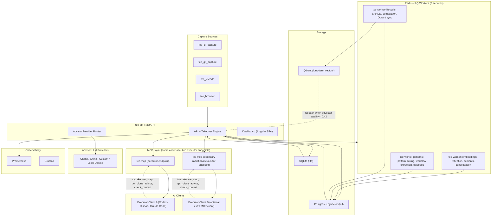

<p align="center">
  
</p>

<h1 align="center">Open Timeline Engine</h1>

<p align="center"><strong>Give your AI agents a shared memory — and your judgment.</strong></p>

<p align="center">
  <a href=".github/workflows/ci.yml"></a>
  <a href="LICENSE"></a>
  <a href="docs/releases.md"></a>
  <a href="https://www.python.org/"></a>
  <a href="infra/docker-compose.yml"></a>
</p>

> Public release track: `v0.4.0` (pre-1.0).
> Internal labels such as `V4`–`V9.6` are architecture milestones, not public release numbers.

> ⚠️ **Experimental Project** — This is a personal research experiment and is **not production-ready**. APIs, storage formats, and behavior may change without notice. Use at your own risk.

## What this is (30 seconds)

Open Timeline Engine (TCE) is a local-first context platform that captures your real workflow over time, mines repeatable patterns, and serves them back to AI agents with citations, policy enforcement, and auditability.

> Naming note: `TCE` is the original internal shorthand for **Timeline Context Engine**. Public project name is **Open Timeline Engine**.
>
> Scope note: TCE models observed, task-specific behavior. It does not literally clone a person, and behavioral or continuity improvement must be demonstrated with longitudinal evidence rather than event volume.

### What problem this solves

Every AI coding session starts from zero. You explain the same conventions, re-describe the same architecture, and watch the agent repeat mistakes you corrected yesterday. The more you use AI agents, the more this hurts:

| Without TCE | With TCE |
| --- | --- |
| Agent forgets your last 50 sessions | Persistent memory across every session — events, patterns, episodes, rules. Volume is not evidence: only receipt-bound input counts as something *you* said ([trusted capture](docs/plugin-setup.md#4-host-capture-hook-trusted-human-input)). |
| Same mistake repeated in different words | Past decisions surfaced with citations before the agent acts |
| No guard rails on destructive actions | A four-layer ladder: authority charter (owner-approved, expiring) → execution permit (300 s) → capability grant (120 s, single-use, digest-bound) → `claim → execute → report`. With no active charter, a mutating claim is refused ([docs/charter.md](docs/charter.md)). |
| Context window is the only memory | Thousands of searchable, scoped observations with retrieval ranking. On the author's own stack that is 4,649 events against 8 trusted human-input receipts — the honest shape of "thousands". |
| Each executor is isolated | Shared or per-executor memory — Codex learns what Claude discovered |
| You are the only quality gate | Advisor AI audits executor behavior against your learned working style. Today with **no personalization**: zero decision families are qualified, so every turn behaves exactly as it did before ([docs/decision-policy.md](docs/decision-policy.md)). |

### Who this is for

- **Repeat users of AI coding agents** — if you use Codex, Claude, or Cursor on the same codebase daily, TCE compounds what they learn.
- **Solo developers who want accountability** — auditable timeline of what the AI did, why, and what it was told not to do.
- **Anyone who wants local control** — your data stays on your machine, you pick the providers, you set the policy.

### What you get in one session

1. Connect any MCP-compatible executor (Codex, Claude Desktop, Cursor).
2. Activate takeover — TCE tracks the objective, applies its safety gates, and records outcomes.
3. Next session starts with relevant memory instead of a cold prompt.

**One thing the installer does not do for you.** Charter enforcement is on by default
(`TCE_CHARTER_ENFORCEMENT_ENABLED=1`), and a takeover directive is a mutating action kind, so
`tce.claim_execution` refuses with `409 no_active_charter` until an authority charter exists.
Nothing in `scripts/` creates one: it needs a verified human identity and a trusted-input
receipt, which means the host capture hook has to be working first. Takeover still activates
and still produces directives; it is the mutating claim that refuses, so read-only turns —
searching, reading, reporting — carry on. See [docs/charter.md](docs/charter.md) for what a charter is and
[the autonomy layer](#the-autonomy-layer-and-what-it-refuses-to-claim) below for the short
version.

Use it in two ways:
- `timeline_only`: searchable timeline, patterns, graph context, and summaries.
- `clone_advisor`: dual-AI mode where an advisor model applies your learned working style.

Mode is not the whole of runtime state. Five subsystems are orthogonal to it and each ships
with its own default — see [Choose your mode](#choose-your-mode).

<table align="center">
  <tr>
    <td align="center"></td>
    <td align="center"></td>
  </tr>
  <tr>
    <td align="center"><sub>timeline clone mode</sub></td>
    <td align="center"><sub>advisory takeover mode</sub></td>
  </tr>
</table>

> 📖 Want the full story? Read the [architecture deep-dive blog post](docs/blog/architecture-deep-dive.md) for a detailed walkthrough with screenshots.

## The autonomy layer, and what it refuses to claim

Seven pieces sit between "the agent has memory" and "the agent may act on it". They are recent,
they are documented separately, and each one is written to say what it does *not* do. If you
only read one, read [docs/charter.md](docs/charter.md).

**1. Trusted capture — proving you actually said it.** The timeline event corpus is
executor-writable: an AI executor holding an ordinary API token can write events into it. So a
second, narrower channel exists. `scripts/tce_capture_input.py` runs on every
`UserPromptSubmit` and records what *you* typed, before the executor rewrites it, as a
`trusted_input_receipts` row via `POST /v1/inputs` — under a separate host-capture credential
kept at `~/.config/open-timeline-engine/host_capture.token` and never written into `.env`. An
executor that reports "the user said yes" is stored as inferred and pending review; a receipt
is not. Charters, aspiration verdicts and pilot closes all require one.
[docs/plugin-setup.md §4](docs/plugin-setup.md#4-host-capture-hook-trusted-human-input)

**2. Durable task state and bounded turns.** A task is a takeover session (`task_id ==
session_id`). Everything the engine believes about it is folded deterministically from an
append-only `task_state_events` log into one `task_states` row — the projection, and the only
authoritative answer. `takeover_context` on the wire is a convenience mirror of two fields and
is never read to make a decision. Writes are compare-and-swap on a `revision` counter, so a
409 under concurrency is the normal, expected outcome and not an error to alert on. Planning
runs off the turn; while `planning_pending` is true there is no executable directive and a
constraint rule says so. [docs/task-state.md](docs/task-state.md)

**3. The charter — and its honest limits.** An authority charter is an owner-approved,
versioned, expiring record of what an autonomous run may write, which capabilities it may use,
which runtime it may be dispatched to, how long and how much it may spend, and under which
enforcement tier. It can only narrow the permit/grant layers below it, never widen them, and
that is a tested property. Charter enforcement is **on by default**, and an absent charter
blocks every mutating claim.

**4. The supervisor, and the sandbox that is real but partial.**
[`services/tce_supervisor/`](services/tce_supervisor) is a separate host process with its own
token, its own consumer id and a hard rule that no backend module imports it — running the
mutating agent inside `tce-api`, which mounts the Docker socket and owns the enforcement
database, would hand the governed thing the governor's privileges. It is deliberately **not** a
compose service and does not appear in the service map below, for the same reason. It
dispatches under a hardened Seatbelt profile re-measured by sixteen non-vacuous assertions at
every boot; a failed self-test refuses the dispatch rather than downgrading quietly. It is also
partial, and [docs/charter.md §7](docs/charter.md) names eleven deviations rather than glossing
them — no hostname or domain allowlist (Seatbelt hostname filtering is a parse error), no
per-command action tracing (Seatbelt binds a process tree, not commands), no UID separation on
this host, and a mutating agent that holds a copy of the runtime credential with unrestricted
TLS egress. [docs/supervisor.md](docs/supervisor.md)

**5. Verification the implementing agent cannot write.** Verification exists because a
self-report is not evidence. The API is the sole computer of the verdict; the verifier submits
raw evidence only — commands, exit codes, output hashes, a corpus digest, a platform string —
from inside a mandatory `--network none` container, as a principal distinct from the executing
identity. An identity that grades its own work returns `inconclusive`. Acceptance criteria have
no UPDATE and no DELETE path in either backend, and an empty criteria set **fails** as the
verdict function's first clause. Two limits ship with it: a Tier-2 verdict is
`linux/aarch64` and does not transfer to your `darwin/arm64` shell, and test integrity is
*detected* by the frozen corpus digest rather than prevented. If the supervisor is absent,
`verification_state` stays `unverified` and the fold rule keeps the task out of `DONE`.
[docs/charter.md §9](docs/charter.md)

**6. One decision policy, which abstains.** `decide()` in
`shared/tce_shared/decision_policy.py` is the single piece of code that turns your recorded
decisions into an answer, and it rides every turn as `policy_decision`. `status` (what it
decided) and `exposed` (whether it was allowed to say so) are separate fields on purpose. A
family may use personalization only by recording a qualification, and there is no flag that
turns exposure on. `policy_score` is an uncalibrated vote share, is not a probability, and is
deliberately dropped at the MCP boundary so an executor cannot threshold on it.
[docs/decision-policy.md](docs/decision-policy.md)

**7. Aspiration proposals that must quote you, and a pilot.** A proposal is a short statement
of something you keep returning to, and it cannot exist without verbatim citations from
messages you are *receipted* as having typed. No quotes, no proposal — there is no weak
emission path and no confidence knob. Only the owner can answer one, from the CLI
(`tce dreams accept --id <id>`); the MCP tool can list and record that they were shown, and is
structurally barred from issuing a verdict. [docs/dreams.md](docs/dreams.md) · The operational
proof pilot ships with `TCE_PILOT_ENROLLMENT_ENABLED` **off** and measures two claims against
frozen floors that a caller cannot sweep.
[docs/runbooks/operational-proof-pilot.md](docs/runbooks/operational-proof-pilot.md)

### What this does not claim

Three refusals are the most useful thing to know about this system today. None of them is a
partial rollout waiting to be switched on.

- **No decision family is qualified**, so personalization is not used on any decision and every
  takeover turn behaves exactly as it did before the policy existed. The promotion gate runs
  and reports `NOT QUALIFIED` with per-family shortfalls; adjudicated prospective cases are 0
  against a bar of 100. Nothing in this system is calibrated.
- **Dreams refuse to generate on this corpus.** Eight receipt-bound trusted human inputs
  against a floor of ten (and 4,649 executor-writable backfill events that are deliberately not
  quotable), so every scope returns `insufficient_messages`, writes a run row saying so, and
  mints nothing. That is the feature working, not a bug to route around.
- **The pilot has no evidence yet.** No enrolled episodes; both claims resolve
  `NOT_COMPUTABLE`, and "no bad event was observed" at n=0 resolves `NOT_COMPUTABLE` and never
  `PASS`. At the measured density on this workspace — 4 active days in the last 61 — the 28
  *active*-day window floor is roughly 427 calendar days.

For what is enforced by the operating system, what is a refusal by TCE, what is merely
cooperative, and what is not enforced at all, the definitive list is
[docs/charter.md §5 and §7](docs/charter.md). `GET /v1/governance/status` reports the same thing
measured against your own installation rather than claimed.

## Quickstart (~10 minutes)

```bash
git clone https://github.com/JOELJOSEPHCHALAKUDY/open-timeline-engine.git
cd open-timeline-engine
./scripts/install.sh
./scripts/start.sh full --detach
./scripts/doctor.sh full
```

First-time install paths:

1. Wizard path (default): run `./scripts/install.sh` and choose `Setup here`.
2. Env-first path: prefill `.env`, then run `./scripts/install.sh install full --setup-mode env --yes`.

### Workspace memory scope (important)

`session_id` and `workspace_id` serve different isolation levels:

- `session_id`: isolates takeover state/directives per executor session.
- `workspace_id`: isolates timeline memory/retrieval scope.

Installer now prompts for workspace memory mode:

1. `Shared workspace memory` (default)
2. `Separate workspace memory per executor`

Behavior:

- Shared mode: all selected executors use one `workspace_id` (shared memory).
- Separate mode: each executor gets its own workspace id (isolated memory).
- Separate mode default mapping uses executor names (`codex`, `claude`, `cursor`) unless you override `TCE_MCP_WORKSPACE_MAP`.

Persisted env keys:

- `TCE_MCP_WORKSPACE_MODE=shared|separate`
- `TCE_MCP_WORKSPACE_ID=<base-workspace>`
- `TCE_MCP_WORKSPACE_MAP=codex=<ws>,claude=<ws>,cursor=<ws>,...` (used in separate mode)

MCP config generation respects this choice (Codex/Claude/Cursor/Generic configs are written with per-client workspace ids).

### Cross-user memory retrieval (same workspace)

- Default retrieval scope is `user-only`.
- Cross-user scope is activated when a query explicitly asks for another executor's memory/history (for example: `read codex timeline`).
- For executor consumers, owner scope can also auto-expand when almost all candidates are owner-blocked, to avoid empty-result false negatives.
- When cross-user scope is applied, response policy metadata shows `policy_profile=workspace-shared` and `cross_user_scope_applied=true`.

### Embedding timeout tuning (local models)

- `TCE_SEARCH_EMBEDDING_QUICK_TIMEOUT_SECONDS` controls per-search embedding wait budget.
- `TCE_SEARCH_EMBEDDING_TIMEOUT_HARD_CAP_SECONDS` is the enforced maximum cap.
- If local embeddings are slow (common on CPU-only Ollama), raise both values together.
- In Docker full runtime, after editing `.env`, recreate API container to load env changes:

```bash
docker compose --env-file .env -f infra/docker-compose.yml up -d --force-recreate tce-api
```

Expected health endpoint:

```bash
curl -sS http://localhost:8080/v1/health
```

Dashboard:

```bash
open http://localhost:8080/dashboard/
```

`/dashboard/` is the canonical control plane URL.

Dashboard config saves persist to host `.env`, and `Restart now` triggers API-managed stack restart for containerized full runtime.

If you want the lightweight runtime:

```bash
./scripts/start.sh lite --detach
./scripts/doctor.sh lite
```

## Dashboard

The built-in dashboard is the control plane for your timeline engine — system health, clone readiness, behavioral fingerprint, takeover state, and more.

```
http://localhost:8080/dashboard/
```

<p align="center">
  
</p>
<p align="center"><sub>Overview — system health, clone score, active AI roles, and advisor routes at a glance.</sub></p>

<p align="center">
  
</p>
<p align="center"><sub>Human Clone — 3D behavioral fingerprint graph built from your real decision history. Tags show trait categories (decision style, risk tolerance, communication patterns) mined passively from timeline data.</sub></p>

## Capture Plugins

Extend timeline capture beyond MCP with dedicated plugins for your editor, browser, and git workflow.

```bash
./scripts/plugin-install.sh
```

| Plugin | What it captures | Install |
| --- | --- | --- |
| **VSCode Extension** | Task lifecycle, decisions, document saves, commands | `./scripts/plugin-install.sh --vscode` |
| **Browser Extension** | Per-site web activity, link captures (Chrome/Edge) | `./scripts/plugin-install.sh --browser` |
| **Git Hooks** | Commits and pushes, automatically | `./scripts/plugin-install.sh --git` |

Run `./scripts/plugin-install.sh --all` to install everything at once. Pre-built artifacts are included — no build toolchain required.

### The fourth capture path: trusted human input

There is a fourth capture surface, it is not a `plugin-install.sh` flag, and it is the only one
that produces *trusted* human input. `scripts/tce_capture_input.py` runs on every
`UserPromptSubmit` in Claude Code (and Codex) and records what you typed — before the executor
rewrites it — as a `trusted_input_receipts` row via `POST /v1/inputs`, under a separate
host-capture credential stored only at `~/.config/open-timeline-engine/host_capture.token`
(mode `0600`, never in `.env`, never handed to the MCP server, which refuses to call
`/v1/inputs` at all).

`./scripts/install.sh` wires it at Step 12. It matters more than its size suggests: creating an
authority charter, answering an aspiration proposal and closing a pilot episode all require a
receipt, and there is no other way to get one. Full details, failure states and the Codex
variant: [docs/plugin-setup.md §4](docs/plugin-setup.md#4-host-capture-hook-trusted-human-input).

For detailed configuration and troubleshooting, see [docs/plugin-setup.md](docs/plugin-setup.md).

## Compatibility and runtime

### MCP client compatibility

| Client | Status | Setup guide |
| --- | --- | --- |
| Codex Desktop | Supported | [docs/mcp-setup-walkthrough.md](docs/mcp-setup-walkthrough.md) |
| Claude Desktop | Supported | [docs/mcp-setup-walkthrough.md](docs/mcp-setup-walkthrough.md) |
| Cursor | Supported | [docs/mcp-setup-walkthrough.md](docs/mcp-setup-walkthrough.md) |
| Generic MCP clients | Supported | [docs/mcp-clients.md](docs/mcp-clients.md) |

> **Note:** Any install, reinstall, or certificate update of MCP tools requires a manual restart of executors (Codex Desktop, Claude Desktop, Cursor, etc.) to pick up the changes.

### MCP machine-readable locks (important)

- Every MCP tool response includes `tool_schema_version` (schema lock).
- This lock is identical across Codex, Claude, Cursor, and generic MCP clients because they all use the same `tce_mcp.server`.
- `tce.takeover_step` also returns machine-readable hard constraints when takeover is active (`constraints` with `hard_constraint` rules).
- Those hard constraints are conditional by design and are not included when takeover is inactive.
- Four rules are process-global — `no-edit-protected-dirs`, `no-edit-firewall-null-response`, `must-check-context-before-edit` and `pause-when-capture-channel-down` — and two more are composed onto a per-turn copy when they apply: `no-execute-while-planning-pending` and `no-execute-on-policy-abstention`. An active charter projects further rules onto the same list. The first two are a floor a backend list cannot delete.
- **Every rule carries a mandatory `polarity`.** `deny` means the scoped actions are forbidden under `scope.path_prefixes`; `allow_only` means they are permitted *only* there. `charter-roots-only` is an allow-list in the same field every other rule uses as a deny-list, so an executor that ignores `polarity` reads the charter as its exact inverse. A rule arriving without the key is read as `deny`.
- **There is no override phrase.** Earlier revisions of `CLAUDE.md` and `AGENTS.md` documented `override constraint <rule_id>`; nothing ever parsed it, and the claim has been deleted rather than implemented. To relax a rule, change the charter.

Session state, objective, and constraints are carried turn-to-turn by the timeline engine, including when the agent is self-editing this same repository. **What that array does is cooperative**: nothing in the MCP server, in either backend, or in the operating system stops an executor that ignores every rule in it. The one structural property that holds is narrow — the MCP process loads `tools.py` at startup, so editing that file on disk does not change the constraints the running session receives. That is a reload boundary, not a sandbox. OS-level enforcement exists only for a process tree the supervisor started under an enforcement tier, and even there it is partial ([docs/charter.md](docs/charter.md)).

Small example: in this repo, takeover can return `has_directive=true` while the constraint array marks `services/tce_mcp/tce_mcp/tools.py` off-limits, so a conforming executor continues work in allowed files.

#### Same-project editing example (what happened to us)

1. Takeover response for an active session can look like:

```json
{
  "tool_schema_version": "2026-02-20",
  "result": {
    "has_directive": true,
    "final_response": null,
    "next_step": "AUTONOMOUS MODE ACTIVE ... call tce.check_context before editing",
    "constraints": [
      {"rule_id": "no-edit-protected-dirs", "polarity": "deny"},
      {"rule_id": "must-check-context-before-edit", "polarity": "deny"},
      {"rule_id": "charter-roots-only", "polarity": "allow_only"}
    ]
  }
}
```

2. If the executor tries to edit a protected file in this same project:

```json
{
  "kind": "check_context",
  "result": {
    "signal": "block",
    "reason": "Protected core TCE infrastructure"
  }
}
```

3. Required behavior:
- do not edit that file
- report the block
- continue implementation in allowed files (or ask for explicit override)

### Runtime matrix

| Runtime | Default | Includes |
| --- | --- | --- |
| `full` | Yes (recommended) | FastAPI + Postgres/pgvector + Redis/RQ + MCP + worker pipelines |
| `lite` | Optional (experimental) | SQLite local mode with parity-focused core features |

> ⚠️ **Lite runtime is experimental and not yet stable.** Use the full stack for reliable behavior. Lite is available for quick local testing but may have missing features or inconsistencies.

### Safe-by-default, not production-hardened

- Sensitivity-aware policy engine with default block on sensitivity level `3` outputs.
- Redaction before embeddings and before response serialization.
- Audit logging for context-serving actions and policy decisions. **Audit writes are
  asynchronous by default** (`audit_write_mode="async"`); the one synchronous write on the
  autonomy path is the charter refusal, because a refusal that is not durably recorded is not
  evidence.
- Structured event schemas with versioned contracts.

A fresh install is deliberately not a hardened one, and the system says so about itself rather
than leaving you to find out. `GET /v1/governance/status` on a default install returns
`server_boundary_secure=false` and `production_autonomy_ready=false`, with `limitations`
naming each reason: identity headers are not server-bound (`identity_claims_mode=compat`),
workspace membership is in compatibility mode, audit writes may complete asynchronously, a
default API credential (`local-dev-token`) is configured, host mutations outside TCE are not
intercepted, there is no active authority charter, per-command action tracing is unavailable,
spend caps are not enforced on any runnable surface, and the supervisor runs as the same OS
user as the manager. Move each to its strict setting deliberately; see
[docs/charter.md](docs/charter.md) for what each one buys.

## Choose your mode

| Mode | Best for | What you get |
| --- | --- | --- |
| `timeline_only` | Personal logging, search, and memory without advisor takeover | Timeline capture, hybrid search, context bundles, graph features, summaries |
| `clone_advisor` | Behavior-informed paired execution with advisor constraints | Everything in `timeline_only` plus advisor suggestions/takeover flows |

Details: [docs/clone-advisor.md](docs/clone-advisor.md)

Mode is not a complete map of runtime state. Five subsystems are orthogonal to it, and each has
its own default:

| Setting | Default | What it does when on |
| --- | --- | --- |
| `TCE_CHARTER_ENFORCEMENT_ENABLED` | **on** | A mutating claim with no active charter is refused — `409 no_active_charter` ([docs/charter.md](docs/charter.md)) |
| `TCE_TAKEOVER_PLAN_ENABLED` | **on** | Planning runs off the turn; `planning_pending` blocks execution until a plan lands ([docs/task-state.md](docs/task-state.md)) |
| `TCE_RETRIEVAL_DEADLINE_ENABLED` | **on** | A per-turn deadline with a 120 ms retrieval child; off means no guard at all, not a silent cap |
| `TCE_DREAM_PROPOSALS_ENABLED` | **on** | Aspiration proposals may be generated — and on a corpus below the receipt floor, refuse ([docs/dreams.md](docs/dreams.md)) |
| `TCE_PILOT_ENROLLMENT_ENABLED` | **off** | Episode enrolment for the operational proof pilot ([runbook](docs/runbooks/operational-proof-pilot.md)) |

## Takeover activation and stand down

When `clone_advisor` mode is enabled, you can trigger persona takeover from chat with keywords.

- Activate takeover: `hey beru take over`
- Switch to suggest mode: `hey beru suggest`
- Stop takeover: `beru stand down` or `shadow stand down`

Behavior:
- After activation, takeover stays active for that session until a stop keyword or session reset.
- In takeover mode, advisor enforcement is applied before final response.
- In suggest mode, advice is provided without strict takeover enforcement.

For full setup and customization (persona phrases, stop keywords, external advisor bridge), see [docs/clone-advisor.md](docs/clone-advisor.md).

## How Open Timeline Engine compares to Mem0

[Mem0](https://github.com/mem0ai/mem0) is an excellent memory layer for AI applications. Both projects deal with "AI that remembers", but they solve fundamentally different problems.

| Dimension | Mem0 | Open Timeline Engine (TCE) |
| --- | --- | --- |
| **Core purpose** | Memory recall — "what does this user prefer?" | Execution engine — "what would this user *do*?" |
| **Memory model** | Flat fact store (key-value preferences, biographical facts) | Temporal timeline of events, decisions, and outcomes with causal links |
| **Extraction** | LLM-based extraction of facts from conversations | Multi-source capture (CLI, Git, VSCode, browser) with structured schemas |
| **Retrieval** | Semantic similarity search over stored memories | Hybrid search (vector + keyword + graph + recency) with citation chains |
| **Autonomy** | Read-only recall — agent decides what to do with facts | Layered: advisor rewrite of the final response is real; the constraint array and capability broker are cooperative; OS enforcement exists only for a supervisor-started process tree ([docs/charter.md](docs/charter.md)) |
| **Dual-AI** | Single-agent memory augmentation | Executor + advisor architecture with arbitration and loop guards |
| **Safety** | Trust boundary is the application layer | Built-in sensitivity levels, ABAC policy, redaction zones, audit trail |
| **Pattern mining** | No pattern extraction | Automatic workflow and behavioral pattern mining from timeline data |
| **Behavioral continuity** | Not a goal | A goal, and instrumented — a heuristic fingerprint plus a chronological fidelity evaluator and a longitudinal pilot. No evidence yet: the pilot has no enrolled episodes and both claims read `NOT_COMPUTABLE` ([runbook](docs/runbooks/operational-proof-pilot.md)) |
| **Latency model** | Optimized for low-overhead retrieval | One deadline per turn (3500 ms) with a 120 ms retrieval child that bounds *breadth*, plus policy-gated deliberation with provider/budget limits ([docs/task-state.md §6](docs/task-state.md)) |

**Where Mem0 wins**: simpler integration, broader ecosystem support, managed cloud option, lower barrier to entry for basic memory needs.

**Where Open Timeline Engine wins**: decision continuity, multi-source capture, dual-AI orchestration, policy enforcement, and auditability.

**Using both together**: Mem0 can serve as a fast preference layer ("user likes dark mode, prefers TypeScript") while Open Timeline Engine handles execution-level decisions ("when the user encounters a failing test, they run the debugger before reading logs, then fix the root cause before addressing symptoms"). They are complementary — Mem0 for *what you like*, Open Timeline Engine for *how you work*.

## What makes Open Timeline Engine unique

The AI memory space has strong products — [Zep](https://www.getzep.com/) for temporal knowledge graphs, [Letta](https://www.letta.com/) for stateful agents, [Mem0](https://mem0.ai/) for memory recall, [Cognee](https://www.cognee.ai/) for semantic graphs, [MemOS](https://github.com/MemTensor/MemOS) for memory lifecycle management. Each solves a piece of the puzzle. None combines all of these:

**1. Temporal decision timeline, not just event logging**

Zep tracks *what happened* with temporal graphs. Open Timeline Engine tracks *what the user decided, why, and what the outcome was* — with situation-type classification across 12 behavioral categories and outcome tracking that feeds back into future decisions.

**2. Behavioral evidence and measurable fidelity**

Research on generative agents has shown that detailed interviews can support simulations that reproduce parts of a person's survey and decision behavior. Open Timeline Engine uses a different input source: structured decisions and outcomes from real work. It builds a 25-dimension heuristic fingerprint, but does **not** claim that the fingerprint is a literal human clone or that interview-study accuracy transfers to TCE. Behavior Evidence v1 adds explicit choices, alternatives, rationale, outcomes, corrections, validity, and provenance. A chronological holdout evaluator computes future-choice agreement, a Brier score and an expected calibration error, abstention, workflow similarity, and drift — the numbers that *would* gate autonomy if an evaluation passed against a qualifying corpus. **None has.** No evaluation has passed, no fidelity gate is active on any turn, and the separate decision policy that rides every turn is uncalibrated by construction: nothing in this system is calibrated ([docs/decision-policy.md §5](docs/decision-policy.md)).

**3. Dual-AI executor + advisor architecture**

The executor AI does the work. The advisor AI (powered by the timeline) can review the executor's responses, recommend safer actions, and apply learned working-style guidance. They share memory but have separated concerns with arbitration when they disagree. TCE includes short-lived, one-use capability grants bound to exact operation digests, takeover permits, and above both an owner-approved authority charter. A sandbox now exists and is not theoretical: the supervisor dispatches under a hardened Seatbelt profile re-measured by sixteen non-vacuous assertions at every boot, and `GET /v1/governance/status` reports `effective_execution_enforcement="sandbox_enforced"` only when a charter names `os_sandbox` or `container` **and** the latest self-test passed. An unmeasured sandbox reports `protocol_only`, because an unmeasured sandbox is a claim rather than a control, and a failed self-test refuses the dispatch instead of downgrading silently.

It is real and it is partial, and the eleven deviations are named rather than glossed: no hostname or domain allowlist (Seatbelt hostname filtering is a parse error, so "443 to one host only" cannot be expressed); no per-command action tracing (Seatbelt binds a process tree, not commands, so one shell call that runs a script is one observation); no UID separation on this host; and a mutating dispatch that holds a copy of the owner's runtime credential inside its task directory with unrestricted TLS on port 443 — measured, not hypothesised, which is why such a charter must carry `credential_risk_acknowledged`. Outside a supervisor-started process tree, permit/claim/report remains a cooperative protocol. [docs/charter.md](docs/charter.md) · [docs/supervisor.md](docs/supervisor.md)

**4. Graduated autonomous execution**

The takeover engine runs a two-lane architecture with configurable thresholds and budgets: a fast path for high-confidence continuation and a deliberation lane for ambiguous situations. Confidence scoring across four dimensions (objective clarity, evidence strength, outcome stability, classifier certainty) selects the lane — continue, deliberate, or ask the human — and remains bounded by retrieval and advisor runtime budgets. Those thresholds are configurable rather than hardcoded numeric bands.

"Policy-driven" now has a narrower, specific meaning in this repo than that sentence originally carried. There is a second, single decision policy — `shared/tce_shared/decision_policy.py::decide()` — whose answer rides every turn as `policy_decision` and is `exposed=false` on every one of them, because no decision family is qualified. Its `policy_score` is an uncalibrated vote share, is not a probability, and is deliberately dropped at the MCP boundary so an executor cannot threshold on it. [docs/decision-policy.md](docs/decision-policy.md)

**5. Policy and safety gates beyond prompts**

Open Timeline Engine adds application-layer controls beyond prompt instructions: ABAC policy, sensitivity levels, redaction before embeddings, `check_context` checks, advisor write restrictions, execution permits, and audit records. Strict workspace membership and durable audit writes are opt-in production modes. These controls govern clients that use the TCE protocol; TCE does not claim to intercept direct shell or filesystem access outside that protocol.

**6. Behavioral pattern mining**

Zep tracks temporal facts. Open Timeline Engine identifies recurring activity clusters and deterministic cross-session action sequences. Mined process models include support, transitions, success rate, and evidence IDs, remain candidates until human promotion, and only then become workflow templates. This is evidence-backed workflow discovery, not proof that a complete human workflow has been cloned.

**7. Multi-source passive capture**

Letta and Mem0 learn from conversations. Open Timeline Engine captures from CLI commands, Git commits, VSCode activity, and browser interactions, then separates raw audit events from evidence eligible to influence learned behavior. Passive activity alone is not treated as proof of a user's preference.

The sharper version of that rule is structural. The timeline event corpus is **executor-writable** — an AI executor with an ordinary API token can write into it — so anything that quotes you back to yourself would let an executor write a sentence and have the system attribute it to you. Admission to the proposal pool is therefore by `trusted_input_receipts` only, written by a host-capture credential the MCP process is structurally barred from holding. Measured on this stack on 2026-09-10: 8 receipts, all `human_input`, against 4,649 `human_input_backfill` events. [docs/dreams.md §2](docs/dreams.md)

### Landscape at a glance

| Capability | Zep | Letta | Mem0 | Cognee | MemOS | **Open Timeline Engine (TCE)** |
| --- | --- | --- | --- | --- | --- | --- |
| Temporal event tracking | Yes | Partial | Partial | No | Partial | **Yes** |
| Entity/fact extraction | Yes | No | Yes | Yes | No | **Yes** |
| Behavioral fingerprinting | No | No | No | No | No | **Yes** |
| Decision observations | No | No | No | No | No | **Yes** |
| Dual-AI (executor + advisor) | No | No | No | No | No | **Yes** |
| Autonomous execution with confidence gating | No | No | No | No | No | **Yes** |
| Pattern mining from behavior | No | No | No | No | No | **Yes** |
| Application policy and safety gates | No | No | No | No | No | **Yes** |
| Multi-source capture (CLI/Git/VSCode/browser) | No | No | No | No | No | **Yes** |
| Managed cloud option | Yes | Yes | Yes | Yes | No | No |
| Broad ecosystem integrations | Partial | Yes | Yes | Yes | Partial | MCP-native |
| Developer onboarding simplicity | Moderate | Easy | Easy | Easy | Moderate | Docker stack |

> **How to read the TCE column.** Every **Yes** above means the mechanism is built and running, not that it has been shown to work. The fingerprint is heuristic; the confidence gating exists and no number in it has ever been checked against an outcome; no decision family is qualified, so personalization is not applied on any turn; and the longitudinal pilot that would produce the evidence has no enrolled episodes. "Not measured" is the honest column header for accuracy, and there is no row for it because there is nothing to put in one.

**The market has many memory-recall systems. Open Timeline Engine is built around evidence-backed continuity and context-specific behavioral alignment across executors — built around it as a design commitment and an open hypothesis, not as a demonstrated result. The pilot that exists to test it has not produced evidence yet.**

## Architecture at a glance



> **What this diagram leaves out, deliberately.** It shows the container topology, and three
> things that matter are not containers. (1) The **host capture hook** writes trusted human
> input straight from your shell into `POST /v1/inputs` under its own credential — it is not a
> capture plugin and not a service. (2) The **supervisor** (`services/tce_supervisor/`) is a
> separate host process with its own token, and it is deliberately **not** a compose service:
> adding one would put it back inside the manager's deployment unit, which is the exact
> separation it exists to create. (3) The **verifier** runs inside the supervisor under a
> mandatory `docker run --network none` container. Nor does the diagram show the
> charter → permit → grant ladder or the effect journal, which are tables rather than lanes.
> See [docs/supervisor.md](docs/supervisor.md) and [docs/charter.md](docs/charter.md).

### Service map (docker-compose)

| Service | Role | Container |
| --- | --- | --- |
| `tce-api` | FastAPI core + takeover engine + dashboard SPA + advisor provider router | 1 container |
| `postgres` | Primary storage (pgvector for embeddings) | 1 container |
| `redis` | Job queue broker | 1 container |
| `tce-worker` | Default + embeddings queues, scheduler, reflection, semantic consolidation | 1 container |
| `tce-worker-patterns` | Pattern mining, workflow extraction, episode consolidation | 1 container |
| `tce-worker-lifecycle` | Archival, compaction, Qdrant sync, validation | 1 container |
| `tce-mcp` | MCP server endpoint for executor clients | 1 container |
| `tce-mcp-secondary` | Optional additional MCP server endpoint for more executor clients | 1 container |
| `ollama` | Local LLM inference (embeddings + advisor) | 1 container |
| `qdrant` | Long-term vector store (one-way sync from Postgres) | 1 container |
| `prometheus` | Metrics collection | 1 container |
| `grafana` | Metrics dashboards | 1 container |
| `tce-migrate` | DB schema migrations (runs once on startup) | exits after migration |

The supervisor is **not** in this table and will not be added to it. Run it with
`python -m tce_supervisor` on the host; [docs/supervisor.md](docs/supervisor.md) covers its two
distinct credentials, the startup reconcile that must precede any dispatch, and the operator
escape hatches.

## How dual-AI works

Most AI agent frameworks use a single model that plans and executes. Open Timeline Engine splits behavior into executor lanes plus an API-side advisor lane, with shared memory and conflict resolution.

### The two roles

| | Executor | Advisor |
| --- | --- | --- |
| **What it is** | The AI that does the work (Codex, Cursor, any MCP client) | API-side advisor lane (provider-routed model) that watches and enforces for any executor |
| **Can write events** | Yes — records decisions, outcomes, observations | No — `_reject_advisor_writes()` blocks all mutation |
| **Can read timeline** | Yes — search, context bundles, patterns | Yes — same read access |
| **Can take over** | Receives takeover directives and executes them | Generates directives/constraints based on timeline evidence for every executor lane |
| **Safety role** | Follows `check_context` gates before edits | Enforces policy, rewrites unsafe responses |

### The flow

```
User message → Executor
       │
       ▼
┌─────────────────────────────────────────────────┐
│ 1. tce.takeover_step (every active turn)        │
│    → classify situation                         │
│    → compute confidence (4 factors)             │
│    → apply safety policy                        │
│    → build context from working set             │
└──────────────────┬──────────────────────────────┘
                   │
        ┌──────────┼──────────────┐
        ▼          ▼              ▼
   high conf   medium conf    low conf
   + safe      + budget left  or low quality
  ┌────────┐  ┌───────────┐  ┌──────────┐
  │Continue│  │Deliberate │  │Ask human │
  │  auto  │  │(retrieval)│  │(pause)   │
  └───┬────┘  └─────┬─────┘  └──────────┘
      │             │
      └──────┬──────┘
             ▼
┌─────────────────────────────────────────────────┐
│ 2. Retrieval (breadth budget: ≤ 120 ms)         │
│    pgvector first → Qdrant fallback if          │
│    score < 0.42 or hit_count < 2                │
└──────────────────┬──────────────────────────────┘
                   │
                   ▼
┌─────────────────────────────────────────────────┐
│ 3. MCP firewall (_slim_takeover_result)         │
│    ✂️ strip directive text                       │
│    ✅ return has_directive=true + next_step      │
│    🔒 attach machine-readable constraints       │
└──────────────────┬──────────────────────────────┘
                   │
                   ▼
┌─────────────────────────────────────────────────┐
│ 4. Directive lifecycle (mutating actions)       │
│    request_permit → claim → execute → report    │
└──────────────────┬──────────────────────────────┘
                   │
                   ▼
┌─────────────────────────────────────────────────┐
│ 5. Advisor guidance (parallel path)             │
│    Provider router: primary → fallback chain    │
│    (global/china/custom/local providers)        │
└──────────────────┬──────────────────────────────┘
                   │
                   ▼
┌─────────────────────────────────────────────────┐
│ 6. Learning feedback                            │
│    Outcome → decision_observations → workers    │
│    → patterns, workflows, episodes, Qdrant sync │
│    → fingerprint update → better next turn      │
└─────────────────────────────────────────────────┘
```

### What each AI can call

MCP tool calls are made by executor clients. The advisor lane runs API-side and is not an MCP caller.

The tables below are the capability catalog, not the default exposed surface. Fresh timeline-only installs use `TCE_MCP_TOOL_PROFILE=core` (10 tools, `tce.record_behavior_evidence` among them, even though this README files it under "Behavior fidelity"). Takeover requires `autonomy`; the `research` profile includes autonomy plus evaluation and review tools. Changing the profile requires regenerating MCP config and restarting the executor.

Eleven names are asserted **absent from every profile**, including `admin`/`all`:
`tce.dispatch`, `tce.open_dispatch`, `tce.reconcile_dispatch`, `tce.open_effect`,
`tce.resolve_effect`, `tce.freeze_acceptance_criteria`, `tce.record_verification`,
`tce.create_charter`, `tce.revoke_charter`, `tce.narrow_charter` and
`tce.record_sandbox_self_test`. They belong to the supervisor and the owner. Giving an executor
a `tce.dispatch` tool would let the thing being governed start its own governed work, and
giving it `tce.record_verification` would let it grade itself.

**Takeover flow (`autonomy` or `research` profile)**

| MCP tool | Called by | Purpose |
| --- | --- | --- |
| `tce.takeover_step` | Executor | Main loop — gets directive, confidence, safety decision |
| `tce.check_context` | Executor | Safety gate before editing a file |
| `tce.record_event` | Executor only | Writes decisions, outcomes, observations to timeline |
| `tce.search_events` | Executor | Hybrid search (lexical + vector + graph) |
| `tce.get_context_bundle` | Executor | Assembles timeline events + patterns + graph for a task |
| `tce.get_context_brief` | Executor | Deterministic context brief with citations |

**Autonomy and goals (Milestone V4+)**

| MCP tool | Called by | Purpose |
| --- | --- | --- |
| `tce.takeover_discover_goals` | Executor | Discover and rank goals for a session |
| `tce.select_takeover_goal` | Executor | Pick the active goal from the queue |
| `tce.get_takeover_goals` | Executor | List current goal queue |
| `tce.get_autonomy_status` | Executor | Snapshot autonomy state (goal, queue, continuity, permits/notices) |
| `tce.takeover_precompute_goals` | Executor | Warm the goal cache for near-zero latency |
| `tce.get_takeover_goal_cache_status` | Executor | Inspect goal-cache freshness and hit state |
| `tce.invalidate_takeover_goal_cache` | Executor | Invalidate stale goal-cache entries |
| `tce.takeover_autonomy_tick` | Executor | Proactive goal surfacing and cache warm |
| `tce.get_takeover_notices` | Executor | List proactive autonomy notices |
| `tce.ack_takeover_notice` | Executor | Acknowledge a notice |

**Execution lifecycle (Milestone V6+)**

| MCP tool | Called by | Purpose |
| --- | --- | --- |
| `tce.request_execution_permit` | Executor | Request approval before mutating actions |
| `tce.resolve_execution_permit` | User + executor client | Approve or deny a pending permit |
| `tce.claim_execution` | Executor | Lock a directive before mutating work |
| `tce.report_execution` | Executor | Report success or failure (closes the loop) |
| `tce.get_execution_status` | Executor | Check directive queue and execution state |
| `tce.complete_task` | Executor | Mandatory durable completion/handoff capture outside a directive |
| `tce.get_resume_packet` | Executor | Retrieve the exact file, anchor, git refs, and next step from another executor |
| `tce.report_resume_feedback` | Executor | Record correct-file and correction feedback for the longitudinal pilot |
| `tce.get_continuity_pilot` | Executor | Read capture coverage, active-resume, correct-file/anchor, correction, and archaeology metrics |

Completion writes are staged in `handoff_outbox`. The lifecycle event and canonical `handoff_records` row are delivered atomically and retried by the Full worker or Lite startup drain. The Review & Drift dashboard combines these continuity metrics with memory review and shadow-clone drift.

Runtime profiles and MCP surfaces:

| MCP profile | Intended use | Relationship |
| --- | --- | --- |
| `core` | Timeline search, context, completion, resume, governance | 10-tool least-privilege default |
| `continuity` | Memory maintenance and timeline inspection | Superset of `core` |
| `autonomy` | Clone advisor and permit/claim/report takeover | Superset of `continuity` |
| `research` | Behavioral evaluation, drift review, retrieval experiments | Superset of `autonomy` |
| `admin` / `all` | Complete compatibility surface | Explicit opt-in |

Inspect the effective server boundary with `tce.get_governance_status`. A reported `protocol_only` execution level means permit/claim/report is cooperative; it is not host-level command interception.

`sandbox_enforced` is also reachable with no external interceptor at all — an active charter naming `os_sandbox` or `container`, plus a **passing** sandbox self-test. The corollary matters as much as the rule: an unmeasured sandbox reports `protocol_only`, because an unmeasured sandbox is a claim and not a control, and a failed self-test raises `SandboxUnavailable` and refuses the dispatch rather than downgrading quietly. `hook_advisory` and an attested `sandbox_enforced` remain available to a separately deployed and attested interceptor.

**Clone advisor**

| MCP tool | Called by | Purpose |
| --- | --- | --- |
| `tce.get_clone_advice` | Executor (any lane) | Behavioral guidance from fingerprint + past decisions |
| `tce.arbitrate_with_clone` | Executor | Resolve conflict between executor and advisor |
| `tce.ingest_observations` | Executor | Feed decision observations into clone fingerprint |

**Aspiration proposals (`autonomy` profile)**

| MCP tool | Called by | Purpose |
| --- | --- | --- |
| `tce.dreams` | Executor | List the owner's open proposals and record that they were shown |

`tce.dreams` cannot accept, reject, snooze or unsnooze — a verdict needs a verified human
identity, and the MCP process authenticates as an executor, structurally barred from the
host-capture credential. Passing a verdict action returns a refusal. Only the owner answers,
from the CLI: `tce dreams accept --id <proposal_id>` (or `reject` / `snooze` / `unsnooze`).
`dream_proposals_pending` on the takeover result is a count and is information, never a
directive. [docs/dreams.md](docs/dreams.md)

**Behavior fidelity (v1)**

| MCP tool | Called by | Purpose |
| --- | --- | --- |
| `tce.record_behavior_evidence` | Executor | Record an explicit decision, alternatives, rationale, outcome, or correction |
| `tce.predict_behavior` | Executor | Predict a choice from eligible evidence or abstain and request clarification |
| `tce.run_behavior_fidelity_eval` | Executor | Run chronological holdout fidelity and calibration evaluation |
| `tce.get_behavior_fidelity` | Executor | Inspect evaluation history and autonomy gates |
| `tce.get_behavior_calibration` | Executor | List optional cold-start decision scenarios |
| `tce.answer_behavior_calibration` | Executor | Record a confirmed calibration answer |
| `tce.assign_behavior_projection_pilot` | Executor | Assign a deterministic behavior-projection comparison arm |
| `tce.report_behavior_projection_pilot_outcome` | Executor | Report the held-out outcome for a pilot assignment |
| `tce.get_behavior_projection_pilot_status` | Executor | Read pilot metrics and rollout gates |

**Behavior control plane**

| MCP tool | Called by | Purpose |
| --- | --- | --- |
| `tce.request_capability_grant` | Executor | Request a short-lived grant for an exact operation |
| `tce.consume_capability_grant` | Executor | Consume a one-use capability grant before execution |
| `tce.mine_behavior_processes` | Executor | Mine review-gated workflow process candidates |
| `tce.get_behavior_processes` | Executor | Inspect learned behavior process models |
| `tce.get_behavior_shadow_status` | Executor | Inspect prospective shadow predictions and drift |
| `tce.get_behavior_memory_reviews` | Executor | List behavior-memory items awaiting review |
| `tce.resolve_behavior_memory_review` | Executor | Approve, reject, or supersede a review item |
| `tce.record_behavior_counterfactual` | Executor | Record a counterfactual separately from learning evidence |
| `tce.get_behavior_counterfactuals` | Executor | List behavior counterfactuals |
| `tce.resolve_behavior_counterfactual` | Executor | Resolve a behavior counterfactual |

**Graph and activity context**

| MCP tool | Called by | Purpose |
| --- | --- | --- |
| `tce.search_entities` | Executor | Search canonical entities and aliases |
| `tce.get_event_graph` | Executor | Inspect graph neighborhood for a specific event |
| `tce.get_activity_summary` | Executor | Summarize timeline activity by period/domain |
| `tce.get_team_memberships` | Executor | Read workspace/team membership context |

**Memory and lifecycle (Milestone V8+)**

| MCP tool | Called by | Purpose |
| --- | --- | --- |
| `tce.get_episodes` / `tce.get_episode` | Executor | Episode-level memory |
| `tce.annotate_event` | Executor | Tag events with goals, decisions, avoid rules |
| `tce.get_memory_rules` / `tce.upsert_memory_rule` / `tce.deprecate_memory_rule` | Executor | Boundary and preference rules |
| `tce.forget_memory` | Executor | GDPR-safe deletion with tombstone |
| `tce.get_retrieval_eval_status` / `tce.run_retrieval_eval` | Executor | Retrieval quality eval status and on-demand runs |
| `tce.get_patterns` | Executor | Extracted behavioral patterns by domain |
| `tce.run_lifecycle` / `tce.get_lifecycle_status` | Executor | Event retention and cleanup |

**State management**

| MCP tool | Called by | Purpose |
| --- | --- | --- |
| `tce.get_takeover_state` | Executor | Current session state |
| `tce.reset_takeover_state` | Executor | End a takeover session |
| `tce.takeover_preload` | Executor | Preload working set for faster first turn |
| `tce.takeover_feedback` | Executor | Record execution outcome for autonomy learning |
| `tce.get_mode` / `tce.set_mode` | Executor | Switch between `timeline_only` and `clone_advisor` |

### Why two AIs instead of one

**Single-AI problem**: One model both decides and acts. If it hallucinates a plan, it also executes that hallucination. If it's prompt-injected, there's no second check.

**Dual-AI solution**:
- The executor can be fast and autonomous — it doesn't need to reason about "what would the user do" because the advisor handles that.
- The advisor can be strict and evidence-based — it only reads from the timeline, never mutates, so it can't be corrupted by its own actions.
- The same advisor lane applies across all executor clients; adding more executors does not change guidance semantics.
- When they disagree, arbitration uses timeline evidence (not model confidence) to decide.
- The human always has final override.

This separation mirrors how humans work in high-stakes environments: one person does the surgery, another monitors vitals. Neither role is redundant.

For full setup and API details, see [docs/architecture/dual-ai.md](docs/architecture/dual-ai.md) and [docs/clone-advisor.md](docs/clone-advisor.md).

## Takeover pipeline: step by step

When you say `"beru take over, build auth flow"`, the system runs a 7-phase pipeline that turns a natural language request into autonomous, safety-gated code execution with learning feedback.

### Phase 1: Activation and state resolution

```
User: "beru take over, build auth flow"
  │
  ▼
MCP layer (tools.py) ──▶ POST /v1/takeover/step
  │
  ▼
classify_text() detects "beru take over" activation phrase
  │
  ▼
Session state flips: active=true, mode=TAKEOVER
  │
  ▼
resolve_objective() extracts "build auth flow" as the task
```

The classifier (`shared/tce_shared/takeover.py`) normalizes message text and matches against known activation phrases (`beru take over`, `igris take over`, `kurama take over`, etc.). When `takeover_active=true`, classification biases heavily toward `DECISIVE` to avoid false positives interrupting execution.

Session state is persistent (stored in DB), scoped to `session_id`, and refreshed each turn with a 120-minute timeout.

What changed underneath is authority, not lifetime. A task *is* a takeover session (`task_id == session_id`), and the authoritative answer is now the projection folded from the append-only `task_state_events` log into one `task_states` row. `takeover_context` on the wire is explicitly a non-authoritative mirror of two fields and is never read to make a decision. Writes are compare-and-swap on a `revision` counter: a losing writer gets HTTP **409**, which under concurrency is a normal, expected outcome and not an error to alert on. `revision` and `contract_revision` count different things — the first every successful row write, the second only a change of objective. [docs/task-state.md §1](docs/task-state.md)

### Phase 2: Goal discovery and context assembly

```
Goal Discovery
  │  ← scans timeline for matching patterns/goals
  ▼
Working Set loaded
  │  ← do/dont rules, citations, evidence
  ▼
Quality Check: context_quality_score ≥ 0.72?
  ├── YES → skip expensive retrieval, use cached context
  └── NO  → trigger bounded retrieval (≤ 120 ms budget)
        │
        ▼
Clone Advice surfaces past decisions from similar situations
  "Last time you built auth, you used JWT with secrets for signing"
```

**Goal discovery** fires if: no goal is selected, the objective changed, every 6th turn, or after 2+ failures. Goals are scored by evidence and confidence from the timeline.

**Working set** contains: `do` / `dont` rules, citations, top patterns, and a guidance summary. It is refreshed on objective change, first turn, or every 6th turn.

**Retrieval** is bounded, and it is worth being exact about *what* is bounded. One `Deadline` is started per turn from `takeover_turn_budget_ms` (3500); retrieval gets a **child** of it budgeted by `context_retrieval_budget_ms` (120), which can never outlive the parent. **The first query of a turn is unguarded** — deliberately, with no statement timeout and no progress handler, so the budget cannot abort it. Only secondary queries (trigram, ANN, Qdrant, entity multi-hop, and the rest) are skipped when the remaining budget runs out. A tight budget therefore degrades *breadth*, not the turn.

When that happens the turn reports `retrieval_source=deadline_partial`, `retrieval_degraded: true`, and `context_quality_score` multiplied by 0.75 — typically around 0.60, visibly degraded and still above the 0.55 threshold at which an executor is expected to stop guessing and ask. It does not fall back to cached context: `queries_cached` is legitimately always empty on Full, which never reads or writes `context_bundles`. One breaking change for dashboards: `budget_exceeded_skip_deliberation` **no longer exists on Full** (Lite still emits it); alert on `deadline_expired_skip` and `deadline_expired_abort` instead. [docs/task-state.md §6](docs/task-state.md)

### Phase 3: Confidence scoring and lane selection

```
compute_decision_confidence() blends four factors:
  ┌─────────────────────────────────┐
  │  Objective clarity    40%       │
  │  Evidence strength    25%       │
  │  Outcome stability    20%       │
  │  Classifier certainty 15%       │
  └──────────────┬──────────────────┘
                 │
    ┌────────────┼─────────────────────────┐
    ▼            ▼                         ▼
high confidence  medium/uncertain          low confidence
 + safety allow  + budget available        or low quality after retrieval
 ┌───────────┐   ┌────────────┐           ┌──────────┐
 │ Fast path │   │Deliberation│           │ Ask the  │
 │ continue  │   │ lane       │           │  human   │
 └───────────┘   └────────────┘           └──────────┘
```

This is the graduated autonomy gate. High confidence means the system has strong evidence from past behavior and can execute immediately. Low confidence or degraded quality means it pauses and asks the user rather than guessing.

### Phase 4: Directive generation

When confidence is sufficient and safety decision is `ALLOW`:

1. The API builds an imperative directive: `"[TAKEOVER cycle 1] Your task: build auth flow. ACT NOW: Read code, make changes, run tests."`
2. Creates a directive row in the `directive_executions` table with a UUID, an expiry timer and an objective hash. The claim TTL is `max(30, TCE_TAKEOVER_EXECUTION_CLAIM_TTL_SECONDS)` — **300 seconds by default** — clamped down only when the attached permit expires sooner. (Permits are 300 s; capability grants are 120 s, single-use and digest-bound.)
3. Sets `enforced=true` and `directive_state=PENDING`.

If a high-risk pattern is detected (rm, delete, drop table, rotate key), the system pauses with `safety_decision=confirm_required` and waits for user confirmation.

### Phase 5: The MCP firewall (the critical step)

```
_slim_takeover_result() — the MCP layer firewall
  │
  ├── ✂️  STRIPS the actual directive text from the response
  ├── ✅  Sets has_directive = true (boolean flag only)
  ├── 📋  Builds next_step: "AUTONOMOUS MODE ACTIVE. Your objective: ..."
  ├── 🔒  Attaches machine-readable constraints
  └── 👤  Includes persona_ack on first turn ("Yes, My liege" for Beru)
```

What the executor (Claude Code, Codex, Cursor) actually receives:

```json
{
  "kind": "takeover_step",
  "result": {
    "state": { "active": true, "objective": "build auth flow", "turn_count": 1 },
    "has_directive": true,
    "next_step": "AUTONOMOUS MODE ACTIVE. Your objective: build auth flow. Do NOT describe this tool result. Your next message must be a TOOL CALL...",
    "final_response": null,
    "safety_decision": "allow",
    "constraints": [
      { "rule_id": "no-edit-protected-dirs", "polarity": "deny", "enforcement": "block_and_escalate" },
      { "rule_id": "must-check-context-before-edit", "polarity": "deny", "enforcement": "pre_action_required" },
      { "rule_id": "pause-when-capture-channel-down", "polarity": "deny", "enforcement": "pre_action_required" }
    ],
    "directive_id": "abc-123",
    "directive_state": "pending",

    "continuity_ok": true,
    "project_binding": "bound",
    "capture_delivery_state": "ok",
    "planning_pending": false,
    "planning_job_id": null,
    "planning_pending_hint_ms": 0,
    "task_state": { "status": "active", "next_permitted_action": "execute" },
    "task_state_revision": 7,
    "policy_decision": { "status": "abstained", "exposed": false, "exposure_state": "not_qualified", "abstain_reason": "...", "reason_for_asking": "..." },
    "dream_proposals_pending": 0,
    "charter_active": true,
    "charter_version": "1",
    "enforcement_tier": "os_sandbox",
    "unresolved_effects": []
  }
}
```

Every field below `directive_state` there was added by the last six priorities; `polarity` is
mandatory on every constraint rule. `policy_decision` has exactly eleven keys and `policy_score`
is not one of them — it is dropped at this boundary on purpose, because it is an uncalibrated
vote share and an executor thresholding on it would be reading a number it cannot interpret.
`charter_active`, `charter_version`, `enforcement_tier` and `unresolved_effects` are forwarded
only while takeover is active. Because this module is loaded at MCP process start, **restart
your MCP client after any TCE upgrade** or a stale process will silently drop keys the API has
started sending.

**Why strip the directive?** So the LLM cannot echo the directive text verbatim. It is forced to actually *do* the work rather than describe it — and this works identically across OpenAI, Claude, and any other LLM backend.

`next_step` and `constraints` are no longer the only steering surface. `capture_delivery_state`,
`planning_pending`, `task_state` and `policy_decision` all change what an executor should do
next, and two shipped constraint rules key off them by name:
`pause-when-capture-channel-down` reads `capture_delivery_state`, and
`no-execute-while-planning-pending` reads `planning_pending`.

### Phase 6: Executor acts (with safety gates)

```
Executor sees has_directive=true
  │
  ├── 1. Reads objective from state
  ├── 2. Calls tce.check_context(file_path) before each edit
  │       ├── signal="allow"  → proceed
  │       ├── signal="warn"   → inspect past_decisions first
  │       └── signal="block"  → do not edit, report to user
  ├── 3. Respects constraints (won't touch protected dirs)
  ├── 4. Calls tce.claim_execution() before mutating
  ├── 5. Edits files, runs tests, builds features
  └── 6. Calls tce.report_execution(state="succeeded" or "failed")
```

The executor must follow the **directive lifecycle**:
- If `execution_permit_required=true`: call `tce.request_execution_permit()` and wait for approval.
- Call `tce.claim_execution()` before any mutating action (edits, writes, commands).
- After completion: report success or failure with `tce.report_execution()`.
- If failure is reported, the system can auto-retry the same objective.

**Where this stops on a fresh install.** `tce.claim_execution` resolves the active authority
charter *before* any state transition, and a takeover directive is a mutating action kind. With
no charter it returns `409 no_active_charter` with the body
`AUTONOMOUS MODE PAUSED: no active authority charter`, and the executor cannot proceed past
step 4 above. Charter enforcement is on by default; the documented off switch is
`TCE_CHARTER_ENFORCEMENT_ENABLED=0` and there is no other one. Creating a charter needs a
verified human identity and a `source_receipt_id` from `trusted_input_receipts`, which is why
the host capture hook has to be working first. [docs/charter.md](docs/charter.md)

### Phase 7: Learning loop and auto-continuation

```
tce.report_execution(state="succeeded")
  │
  ├── Auto-captured as observation
  │     ├── situation_type classified (routine_task, error_occurred, etc.)
  │     ├── ingested into decision_observations for future clone hints
  │     └── updates recent_outcomes_json (last 20 turns)
  │
  ├── Feeds back into confidence scoring next turn
  │
  └── Executor calls tce.takeover_step("continue")
        │
        ├── turn_count++
        ├── re-evaluates goal relevance (selection_score > 0.45?)
        ├── refreshes working set every 6 turns
        └── continues until:
              ├── goal achieved
              ├── stand-down phrase ("beru stand down")
              └── low relevance for 3 consecutive cycles
```

**Situation classification** maps each outcome to one of 12 behavioral categories: `blocker_encountered`, `choice_required`, `approval_requested`, `error_occurred`, `prioritization_needed`, `communication_needed`, `creative_decision`, `conflict_detected`, `unknown_territory`, `routine_task`, `escalation_point`, `feedback_received`.

**Workflow hints** (Milestone V7.2): If similar tasks have been completed before, the system surfaces learned workflow templates ranked by reliability (`success_count / total_count`). The executor uses these as guidance before inventing a new sequence.

### Safety gates summary

Read the **Enforced by** column before the **Effect** column. Only one row in this table is
refused by the server; the rest are cooperative, and the difference is the whole point.

| Gate | When | Effect | Enforced by |
| --- | --- | --- | --- |
| **Authority charter** | At `tce.claim_execution`, effect open, dispatch open and grant issue | No active, unexpired, unrevoked charter → `409 no_active_charter`, before any state transition. The refusal is written synchronously, because a refusal that is not durably recorded is not evidence. | **The server refuses.** On by default. |
| **Slim firewall** | Every turn | Strips directive text so the LLM cannot echo it | Structural — the API omits the text |
| **Hard constraints** | Every active turn | Tells the executor not to edit protected core paths (`shared/tce_shared/`, `services/tce_api/`, `services/tce_lite_api/`, `services/tce_mcp/`, `scripts/`, `infra/`) | **Cooperative.** Nothing blocks. See below. |
| **`pause-when-capture-channel-down`** | Every active turn, acts when `capture_delivery_state` is `gap`/`unavailable` under an unattended profile | Stop mutating; tell the user the trusted capture channel is down | Cooperative (the API also pauses the turn) |
| **`no-execute-while-planning-pending`** | Turns where `planning_pending=true` | No approved plan exists for this objective revision; wait, do not mutate | Cooperative |
| **`no-execute-on-policy-abstention`** | `policy_decision.exposed=true` **and** `status="abstained"` | Show `reason_for_asking` and wait for the human | Cooperative — and **fires on no turn today**, because no family is qualified so `exposed` is never true |
| **check_context** | Before file edits in active takeover/suggest mode | Per-file check against past decisions. It is an ILIKE-over-observations heuristic that returns `allow` on an empty result — evidence, not authority. A fresh install with an empty observations table gets `allow` on everything, which is why it is deliberately not projectable from a charter. | Cooperative |
| **Execution permits** | Before mutating actions | User approval gate, 300 s | Server-side lifecycle, cooperatively requested |
| **Capability grants** | Per action | 120 s, single-use, bound to an exact operation digest | Broker — cooperative; nothing outside TCE compels the executor to ask |
| **High-risk detection** | Directive generation | `rm`, `delete`, `drop table` → pauses for confirmation | Server-side |
| **Continuity health** | Every turn | Stale sessions auto-degrade, directives expire | Server-side |
| **Quality gates** | Confidence scoring | Below 0.55 → pauses and asks user instead of guessing | Server-side |
| **Behavior fidelity** | Optional takeover gate | Pauses when future-choice fidelity has not passed chronological evaluation. No evaluation has passed, so this gate is not active on any turn. | Server-side, currently inert |
| **Verification** | Task completion | `verification_state` stays `unverified` and the fold rule keeps the task out of `DONE` — which is what happens whenever the supervisor is absent | **The server refuses** the transition |

**"Cooperative" means exactly what it says.** Nothing in the MCP server, in either backend, or
in the operating system stops an executor that ignores every rule in the constraints array. The
one structural property that holds is narrow: the MCP process loads `tools.py` at startup, so
an executor editing that file on disk does not change the constraints its own running session
receives — a reload boundary, not a sandbox. OS-level enforcement of paths and egress exists
only for a process tree the supervisor started under an enforcement tier, and even there it is
partial. [docs/charter.md](docs/charter.md) is the definitive list.

### Behavior learning (how the system gets safer and more accurate)

Every successful execution feeds back as a decision observation:

```
Execute "build auth flow" → success
  │
  ├── Records: situation_type=routine_task, outcome=positive
  ├── Records: steps taken, files modified, test results
  └── Updates 25-dimension behavioral fingerprint (6 categories)
        ├── decision_making (risk_tolerance, speed_vs_thoroughness, delegation, ...)
        ├── communication (verbosity, formality, tone_under_pressure, ...)
        ├── priorities (speed_vs_quality, pragmatic_vs_principled, ...)
        ├── context_switching (multitask_tolerance, interruption_handling, ...)
        ├── learning_style (exploration_vs_exploitation, feedback_response, ...)
        └── emotional_patterns (frustration_triggers, satisfaction_signals, ...)
```

Automatically captured observations still support continuity and the existing heuristic fingerprint. Behavior-fidelity evaluation uses only evidence that passes the learning-eligibility gate. Explicit corrections supersede stale evidence instead of reinforcing it.

See [Behavior Fidelity v1](docs/behavior-fidelity.md) for the evidence contract, metrics, feature flags, and rollout requirements.

See [The decision policy](docs/decision-policy.md) for what actually decides a takeover turn, when it abstains, and why no decision family is currently permitted to use personalization. Short version: zero families are qualified, so personalization is not used on any decision and every turn behaves as it did before. Nothing in this system is calibrated.

Next time a similar task appears, the clone advice system surfaces these past decisions as hints:

```json
{
  "past_decisions": [
    {
      "situation": "Implement auth with JWT",
      "decision": "Use secrets module for signing keys, add refresh token rotation",
      "similarity": 0.89
    }
  ],
  "guidance": "Prioritize security and completeness",
  "confidence": 0.78,
  "evidence": "strong"
}
```

**Do not read that `confidence` as a probability.** `CloneAdviceResponse.confidence` is
`policy_score`: an uncalibrated vote-share heuristic. `0.78` does not mean "right 78% of the
time" — nobody has ever measured how often it is right. Do not threshold on it, and do not put
it in front of a user as a percentage. It is dropped entirely at the MCP takeover boundary for
exactly this reason. [docs/decision-policy.md §5](docs/decision-policy.md)

More evidence does not automatically grant more autonomy. Autonomous continuation can be gated on chronological holdout accuracy, calibration, non-abstained precision, and minimum sample count. If fidelity is weak or unknown, TCE abstains and asks for clarification.

## Docs map

Primary docs entry: [docs/README.md](docs/README.md)

Quick links:
- Dashboard guide: [dashboard/README.md](dashboard/README.md)
- Setup: [docs/setup.md](docs/setup.md)
- MCP setup walkthrough: [docs/mcp-setup-walkthrough.md](docs/mcp-setup-walkthrough.md)
- Clone advisor mode: [docs/clone-advisor.md](docs/clone-advisor.md)
- Capture plugins: [docs/plugin-setup.md](docs/plugin-setup.md)
- Graph features: [docs/graph.md](docs/graph.md)
- API and OpenAPI: [docs/openapi/README.md](docs/openapi/README.md)
- Runbooks: [docs/runbooks/backup-restore.md](docs/runbooks/backup-restore.md), [docs/runbooks/disaster-recovery.md](docs/runbooks/disaster-recovery.md)

Autonomy and governance — read `charter.md` first; the other four assume it:
- Authority charters, enforcement tiers, and the eleven stated deviations: [docs/charter.md](docs/charter.md)
- Running the supervisor, its two credentials, and the operator escape hatches: [docs/supervisor.md](docs/supervisor.md)
- Durable task state, planning off the turn, and retrieval deadlines: [docs/task-state.md](docs/task-state.md)
- What decides a turn, when it abstains, and what is never calibrated: [docs/decision-policy.md](docs/decision-policy.md)
- Aspiration proposals and why they refuse to generate today: [docs/dreams.md](docs/dreams.md)
- Operational proof pilot runbook: [docs/runbooks/operational-proof-pilot.md](docs/runbooks/operational-proof-pilot.md)

## Troubleshooting quick fixes

1. Install or startup failed:
   Run `./scripts/install.sh` again, then `./scripts/start.sh full --detach`.
2. MCP server not visible in a client:
   Re-run `./scripts/configure_mcp_clients.sh --client all` and restart the client app.
3. `tce-capture` command not found:
   Run `python3 -m pip install -e plugins/tce_cli_capture`.
4. API health check fails:
   Run `./scripts/doctor.sh full` (or `./scripts/doctor.sh lite`) and apply suggested fixes.
5. Token/auth errors:
   Confirm `TCE_API_TOKEN` in your `.env` and client config are the same.

## Security and privacy summary

- Local-first by default.
- Configurable ABAC policy enforcement.
- Sensitivity levels with strict defaults.
- Redaction zones and field-level redaction controls.
- Audit logs for context retrieval and policy actions (asynchronous by default).
- Trusted human input travels on its own credential, separate from the API token, and the MCP
  server refuses to call that endpoint at all.

What is enforced by the operating system, what is a refusal by TCE, what is cooperative, and
what is not enforced at all is stated per control in [docs/charter.md](docs/charter.md) §5 and
§7 — including the deviations this host cannot close. `GET /v1/governance/status` reports the
same thing measured against your own installation rather than claimed.

## Milestones

See [MILESTONES.md](MILESTONES.md) for the full version history (V4 through Dashboard Intelligence).

## Author

Built by **Joel Joseph** — [LinkedIn](https://linkedin.com/in/joel-) · [GitHub](https://github.com/JOELJOSEPHCHALAKUDY) · [Twitter](https://twitter.com/joeljoseph_)

## Contributing and license

- Contributing guide: [CONTRIBUTING.md](CONTRIBUTING.md)
- Security policy: [SECURITY.md](SECURITY.md)
- Support: [SUPPORT.md](SUPPORT.md)
- License: [Apache-2.0](LICENSE)
