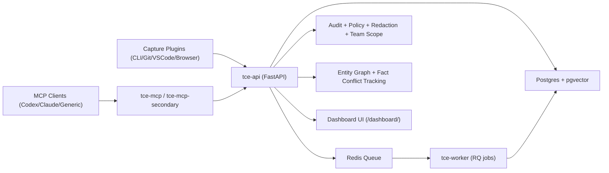
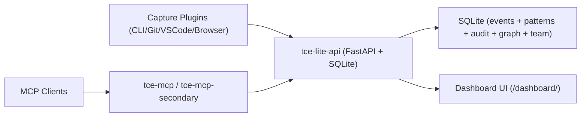

# Architecture

## Full Stack (default)

```mermaid
flowchart LR
  A["Capture Plugins (CLI/Git/VSCode/Browser)"] --> B["tce-api (FastAPI)"]
  B --> C["Postgres + pgvector"]
  B --> D["Redis Queue"]
  D --> E["tce-worker (RQ jobs)"]
  E --> C
  F["MCP Clients (Codex/Claude/Generic)"] --> G["tce-mcp / tce-mcp-secondary"]
  G --> B
  B --> H["Audit + Policy + Redaction + Team Scope"]
  B --> J["Entity Graph + Fact Conflict Tracking"]
  B --> I["Dashboard UI (/dashboard/)"]
```

## Lightweight Stack (optional separate path)

```mermaid
flowchart LR
  A["Capture Plugins (CLI/Git/VSCode/Browser)"] --> B["tce-lite-api (FastAPI + SQLite)"]
  C["MCP Clients"] --> D["tce-mcp / tce-mcp-secondary"]
  D --> B
  B --> E["SQLite (events + patterns + audit + graph + team)"]
  B --> F["Dashboard UI (/dashboard/)"]
```
