# I Built an Open-Source Memory and Autonomy Layer for AI Agents — Here’s the Architecture

*February 2026 | Joel Joseph*

---

Most coding agents still reset to “first day on the job” between sessions.

They can produce code quickly, but they usually forget:

- what you decided last week
- why you decided it
- which outcomes were good or bad
- which boundaries should never be crossed without confirmation

I built **Open Timeline Engine (TCE)** to close that gap with two connected systems:

1. a **memory and clone loop** that captures decisions and turns them into reusable behavioral guidance
2. a **safe autonomy lifecycle** that allows execution with permit/claim/report controls instead of blind freedom

This post walks through the current architecture and behavior in production-style terms.

---

## Why AI Agents Keep Failing

Three failure modes show up repeatedly in real usage:

1. **Session resets**  
   Context windows help inside one chat, but cross-session continuity is weak unless memory is persisted and queried correctly.

2. **No personalization loop**  
   Most systems store facts, not decision behavior. They miss pattern-level signals like risk style, communication preference, and tradeoff history.

3. **Unsafe autonomy**  
   It is usually all-or-nothing: ask for everything or act on everything. TCE uses graduated controls with explicit execution gates.

TCE is designed to keep those three concerns in one runtime instead of bolting them together as separate tools.

---

## The Architecture at 10,000 Feet

TCE is event-centric. Decisions, outcomes, constraints, and feedback are recorded as events and then enriched asynchronously into observations, patterns, episodes, and workflow hints.

```text
User + AI Clients
    │
    ├─ Executor clients (Codex / Cursor / Claude Code / etc.)
    └─ Additional executor clients (optional extra MCP clients)
    │
MCP Layer (same codebase, two executor endpoints)
    ├─ tce-mcp (executor role)
    └─ tce-mcp-secondary (additional executor role endpoint)
    │
tce-api (FastAPI)
    ├─ takeover engine
    ├─ advisor provider router
    └─ dashboard SPA
    │
Storage + Runtime
    ├─ Postgres + pgvector (full)
    ├─ SQLite (lite parity runtime)
    ├─ Redis (queue/cache)
    ├─ Ollama / web providers (advisor + embeddings)
    └─ Qdrant (long-term vector sync/fallback path)
    │
Workers (3 services via Redis/RQ)
    ├─ embeddings + reflection + semantic consolidation
    ├─ patterns + workflow extraction + episodes
    └─ lifecycle + retention + long-term sync
```

What matters operationally:

- `tce-api` hosts API endpoints, takeover logic, provider routing, and dashboard assets.
- MCP is deployed as executor identities (`tce-mcp`, `tce-mcp-secondary`); advisor model routing stays API-side.
- Full and lite runtimes keep response-shape parity where possible.
- Dashboard exposes health, takeover flow, memory views, and advisor route controls.


*Overview emphasizes runtime state and route visibility; labels are driven by saved config rather than hardcoded assumptions.*

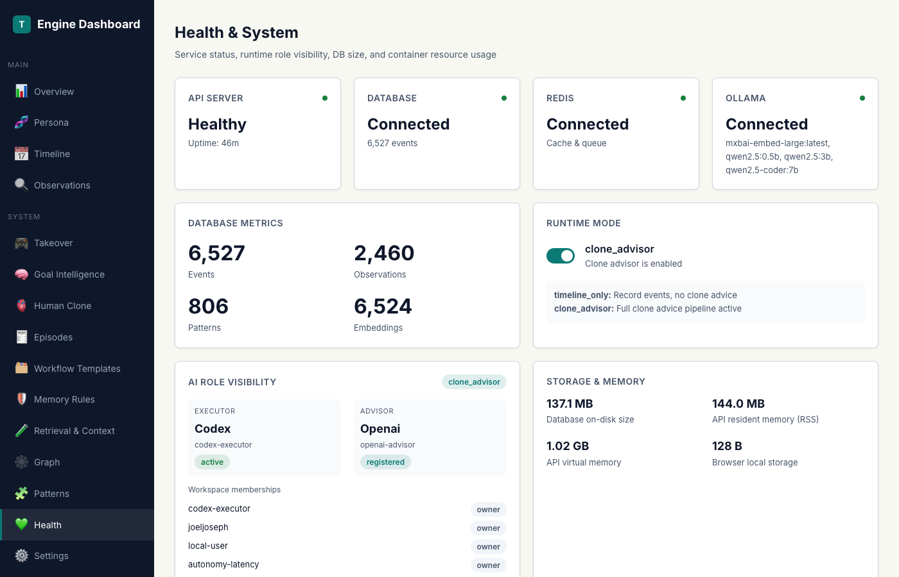
*Health page provides service status, storage/runtime info, and mode visibility (`timeline_only` vs `clone_advisor`).*

---

## Pipeline 1: How Your Agent Learns From You

This loop turns raw activity into behavior-aware guidance.

### The Scenario

You are deciding sync vs async for an endpoint. You choose async and explain why. Later, a similar choice appears again.

### Step 1: Situation Classification

Incoming text/events are normalized into one of the canonical situation types:

| Situation Type | Typical trigger pattern |
|---|---|
| `blocker_encountered` | blocked/dependency/dead-end |
| `choice_required` | choose/select/decision/tradeoff |
| `approval_requested` | approve/sign-off/permission |
| `error_occurred` | error/failure/exception |
| `prioritization_needed` | urgent/priority/order |
| `communication_needed` | reply/announce/coordinate |
| `creative_decision` | design/naming/UX choice |
| `conflict_detected` | conflict/incompatible/mismatch |
| `unknown_territory` | new/uncertain/first-time |
| `routine_task` | stable/default operational work |
| `escalation_point` | legal/compliance/high-risk escalation |
| `feedback_received` | review/comments/corrections |

### Step 2: Observation Recording

Decisions are persisted as observations with canonicalized situation typing and optional outcome fields.

```json
{
  "situation_type": "choice_required",
  "situation_summary": "sync vs async for DB endpoint",
  "user_response": "Use async for DB-bound operations",
  "response_reasoning": "Lower contention and better throughput under load",
  "outcome": "Endpoint stayed within latency target",
  "outcome_sentiment": "positive",
  "confidence": 0.82
}
```

Important details:

- Observations are append-first and traceable.
- Contradictory historical observations can be marked with `superseded_by`.
- Embeddings are queued asynchronously (attempted in background; not guaranteed synchronously in-request).

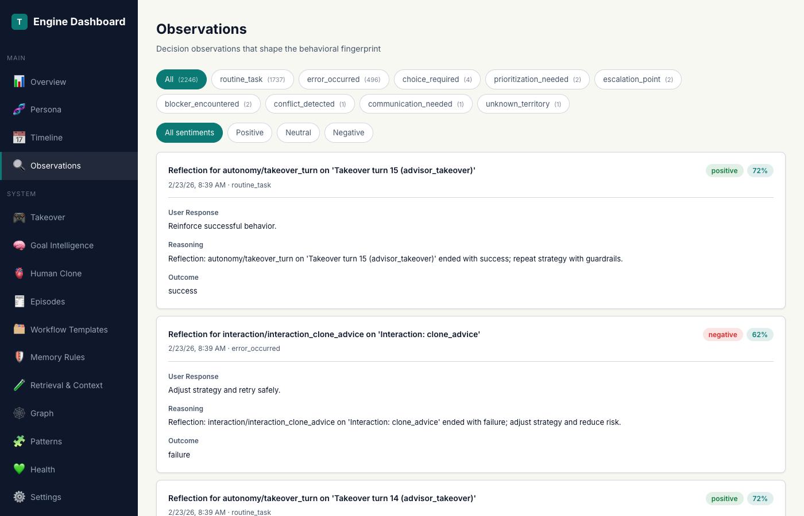
*Observations can be filtered by situation type and sentiment to inspect decision history quality.*

### Step 3: Behavioral Fingerprint

TCE maintains a 25-dimension fingerprint across 6 categories:

- decision making
- communication
- priorities
- context switching
- learning style
- emotional patterns

Updates are EMA-style and feedback-adjusted, so new evidence shifts behavior gradually rather than replacing history in one turn.


*Human Clone view renders stable traits and recent decision dynamics as separate graph signals.*

### Step 4: Clone Guidance Retrieval

Guidance retrieval uses a hybrid model:

1. **baseline recall** (lexical + vector + contextual scoring)
2. **bounded expansion** only when quality/confidence/evidence gates indicate ambiguity
3. **fallback path** when expansion times out or backend quality is low

The result includes evidence strength so the executor knows whether guidance is a strong rule or a weak hint.

### Step 5: MCP Slim Result Firewall

Raw internal payloads are richer than what the executor should consume directly.  
The MCP layer (`_slim_takeover_result`) returns a compact, action-oriented shape.

```json
{
  "clone_hints": {
    "past_decisions": [
      {
        "situation": "DB endpoint concurrency choice",
        "decision": "Prefer async for I/O-bound paths",
        "recall_source": "hybrid"
      }
    ],
    "do": ["Use non-blocking I/O for DB-heavy endpoints"],
    "dont": ["Assume sync simplicity is free under load"],
    "confidence": 0.78,
    "evidence": "moderate"
  },
  "context_quality_score": 0.74,
  "retrieval_triggered": false,
  "retrieval_source": "pgvector_ann",
  "next_step": null
}
```

### The Closed Loop

```text
Decisions → Observations → Fingerprint → Guidance → Better Decisions
     ↑                                                  │
     └──────────────────────── Feedback ────────────────┘
```

For shared learning quality, identity consistency matters: workspace/user headers should remain stable across clients.

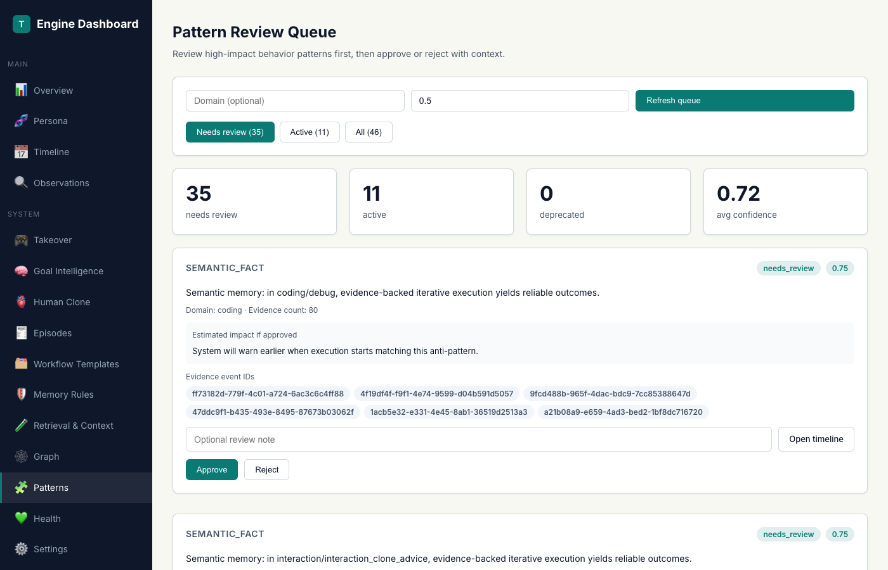
*Patterns are mined from timeline evidence and can be reviewed for signal quality.*

---

## Pipeline 2: How Your Agent Acts Safely

The autonomy lifecycle is permit-gated and stateful.

### Step 1: Takeover Activation

Takeover/suggest activation is phrase-driven and persistent per session until stand-down/reset.

- activation examples: `beru take over`, `igris take over`, `kurama take over`
- suggest example: `beru suggest`
- stop examples: `beru stand down`, `shadow stand down`

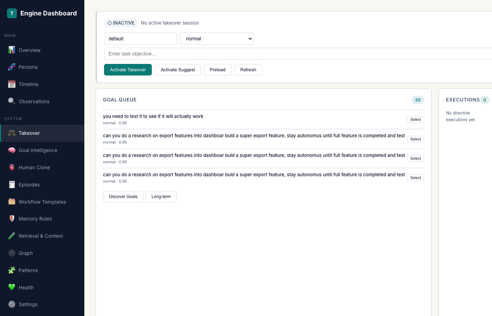
*Takeover UI shows session state, objectives, queue, executions, and learned workflow hints.*

### Step 2: Goal Discovery & Selection

Active sessions discover and rank goals. Queue ordering is based on combined scoring signals (priority/risk/confidence/selection score), with cache acceleration for hot turns.

### Step 3: Mutating Intent Detection

When mutating intent is detected, the runtime prepares execution controls:

1. create/update directive execution (`pending`)
2. evaluate permit requirement
3. pause actionable mutation until permit/claim rules are satisfied

### Step 4: Permit Gate

Risk and policy drive permit behavior:

- risk tiers: `low`, `medium`, `high`, `critical`
- policy profiles:
  - `human_safe`
  - `human_consultative`
  - `human_aggressive`

Sensitive path policies can force confirmation regardless of profile.

### Step 5: Claim & Execute

Execution lock model:

- `pending` → `in_progress` via `claim_execution`
- claim is bounded (TTL/permit coordination)
- prevents duplicate execution races

### Step 6: Report & Retry

After execution:

- success: report `succeeded`
- failure: report `failed` with classified failure and retry strategy

Directive states are:

- `pending`
- `in_progress`
- `succeeded`
- `failed`
- `blocked`
- `abandoned`

Failure classes (examples): `tool_error`, `constraint_block`, `safety_block`, `validation_failure`, `timeout`, `unknown`  
Retry strategies (examples): `narrow_scope`, `read_only_diagnose`, `alternate_path`, `rollback_then_retry`, `escalate`.

### Step 7: Hard Constraints

When takeover/autonomy enforcement is active, machine-readable constraints can be attached directly in tool results.

```json
{
  "directive_type": "hard_constraint",
  "rule_id": "no-edit-protected-dirs",
  "scope": {
    "path_prefixes": ["shared/tce_shared/", "services/tce_api/", "infra/"],
    "actions": ["edit", "delete"]
  },
  "enforcement": "block_and_escalate",
  "reason": "Protected infrastructure scope"
}
```

### The Complete Lifecycle

```text
takeover_step
  ├─ classify + score + safety
  ├─ if mutating: permit required?
  │    ├─ no permit: request_execution_permit
  │    └─ permit approved: claim_execution
  ├─ execute objective work
  └─ report_execution
       ├─ succeeded → continue queue / ask next objective
       └─ failed → classify_failure + retry strategy or escalate
```

---

## Live Demo: Takeover in Action

Activation example:

```text
beru take over — Refactor auth module to support token rotation
```

Executor-facing shape (illustrative, not hardcoded runtime IDs):

```json
{
  "state": {
    "active": true,
    "mode": "takeover",
    "takeover_context": {
      "objective": "Refactor auth module to support token rotation",
      "turn_count": 1
    }
  },
  "has_directive": false,
  "directive_id": "<directive-id>",
  "directive_state": "pending",
  "execution_permit_required": true,
  "next_step": "AUTONOMOUS MODE PAUSED. Call tce.request_execution_permit(...)",
  "constraints": [
    {"rule_id": "no-edit-protected-dirs", "enforcement": "block_and_escalate"},
    {"rule_id": "must-check-context-before-edit", "enforcement": "pre_action_required"}
  ],
  "workflow_hints": [
    {
      "steps": ["Scope change", "Apply minimal edit", "Validate outcome"],
      "reliability": 0.94
    }
  ]
}
```

Expected flow after this response:

1. `request_execution_permit`
2. `claim_execution`
3. execute work
4. `report_execution`

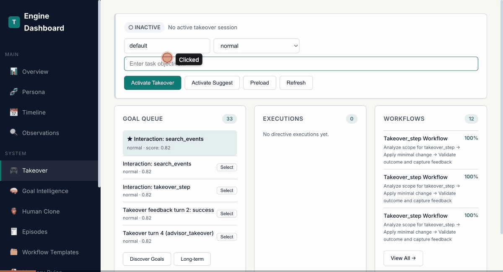
*Active takeover view exposes objective progress, directive state, queue, and execution history in real time.*

---

## What the Dashboard Shows

The dashboard is the control plane for memory quality, takeover state, and advisor routing.

Core pages:

- **Overview**
- **Takeover**
- **Human Clone**
- **Workflow Templates**
- **Episodes**
- **Memory Rules**
- **Settings**

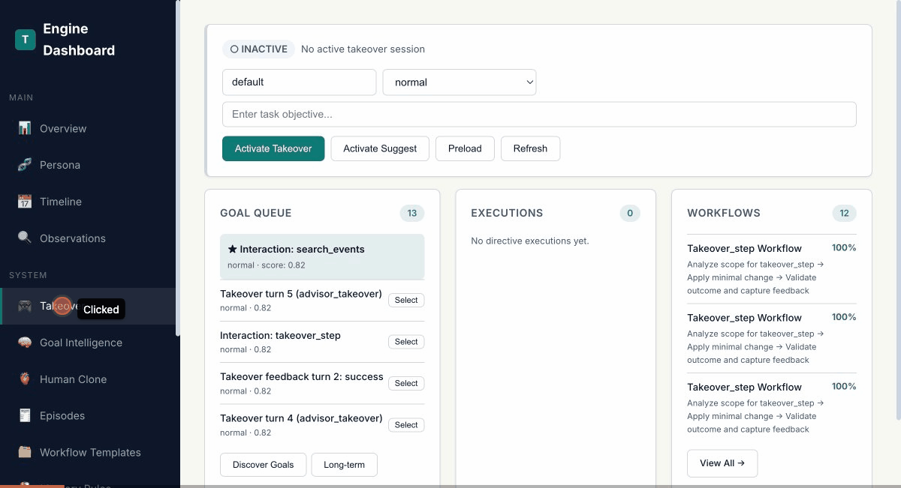
*Dashboard navigation focuses on operational visibility instead of hidden background state.*

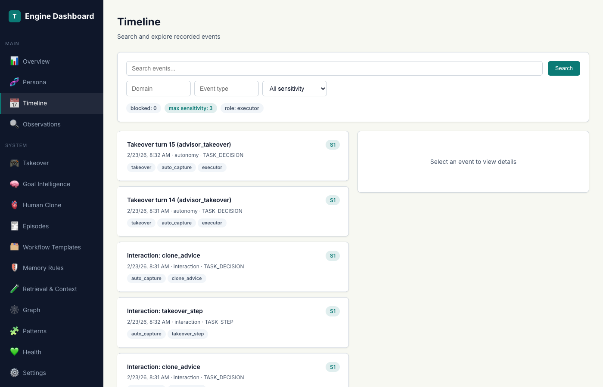
*Timeline supports search, filtering, and deep event inspection.*

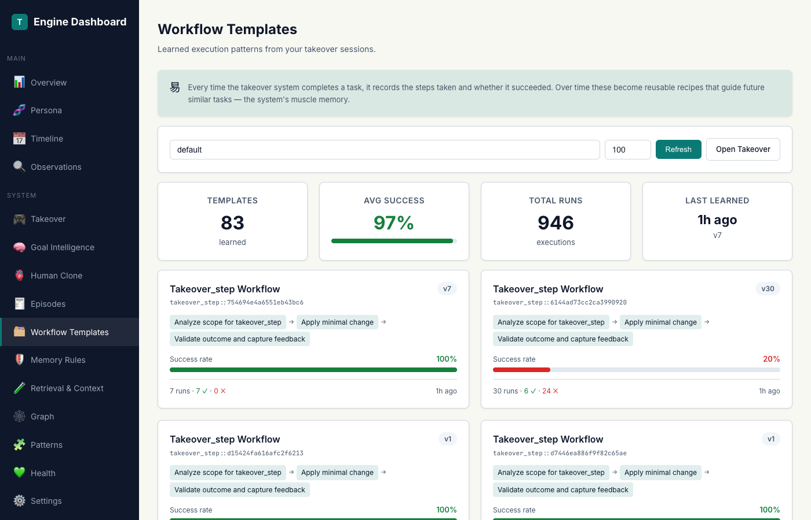
*Workflow templates expose reusable execution sequences with reliability tracking.*

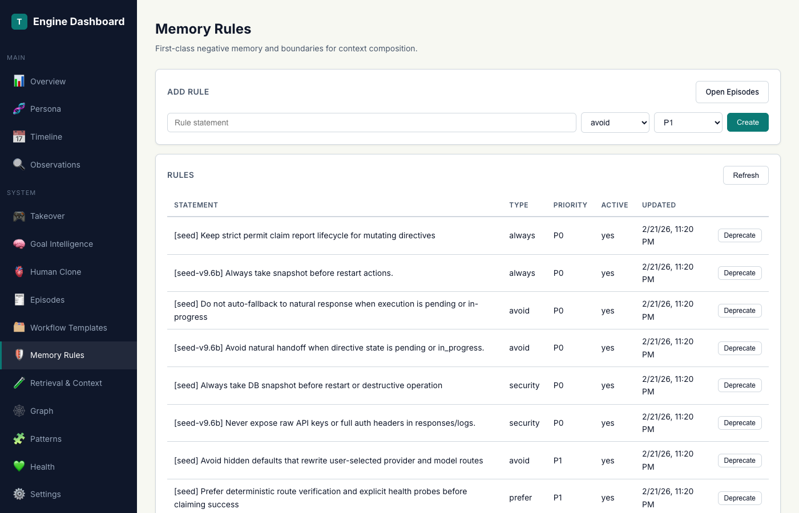
*Memory rules are first-class constraints/preferences with scope and priority.*

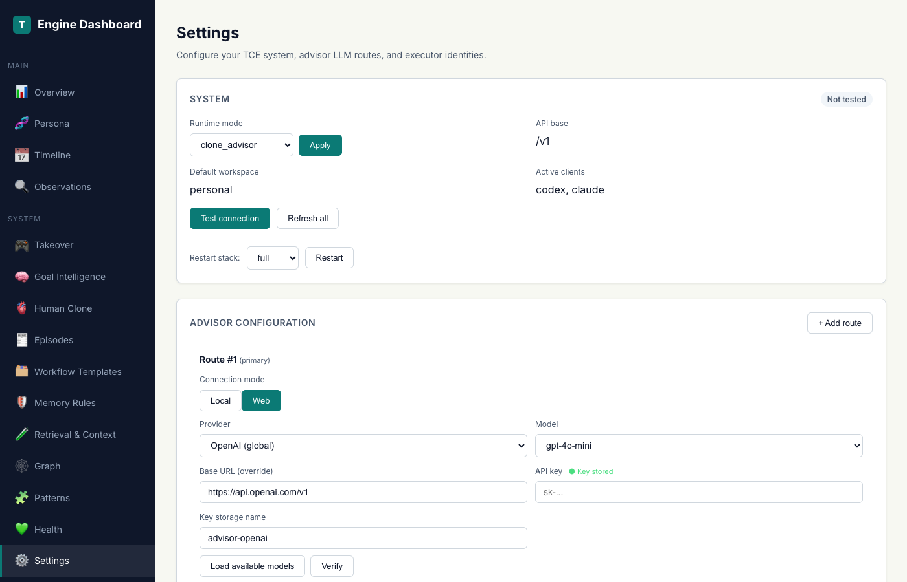
*Settings separates advisor route management from executor config, with route verify/probe and restart-required apply flow.*

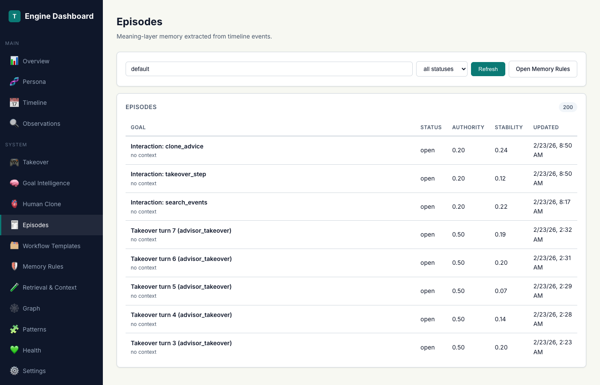
*Episodes aggregate event-level traces into narrative memory (goal, context, outcome, lessons).*

### Settings flow (current model)

Advisor configuration is explicit and mode-first:

1. choose **Local** or **Web** for primary route
2. local platforms: **Ollama** or **LM Studio**
3. web providers: global/china/custom categories
4. verify primary route
5. configure ordered fallback route cards
6. save config (writes `.env`)
7. apply via restart workflow

---

## The Technical Deep Dive

### Database shape (full runtime)

TCE uses Postgres with pgvector as primary storage in full runtime.

| Table | Purpose |
|---|---|
| `events` | immutable timeline events |
| `event_embeddings` | vector index linked to events |
| `decision_observations` | decision/outcome memory with superseding support |
| `behavioral_fingerprints` | consumer/workspace fingerprint state |
| `episodes` + `episode_*` | episode-level narrative memory and links |
| `patterns` | extracted behavior/workflow patterns |
| `workflow_templates` | learned reusable sequences |
| `takeover_sessions` | session state and context |
| `autonomy_goals` | discovered goal queue |
| `directive_executions` | execution lifecycle state |
| `execution_permits` | permit decisions and expiry |
| `memory_rules` | persistent rules/constraints/preferences |
| `memory_tombstones` | delete/tombstone records |
| `event_identity` | idempotency/ordering identity support |

Lite runtime keeps equivalent logical shapes in SQLite for parity-oriented behavior.

### Worker architecture

Three worker services process asynchronous jobs via Redis/RQ:

1. embeddings + reflection + semantic consolidation jobs
2. pattern mining + workflow extraction + episode tasks
3. lifecycle jobs (retention/compaction/long-term sync)

### Security model

- policy + risk gating before mutating actions
- ingest redaction for sensitive token classes
- audited read/write flows and policy decisions
- memory-forget workflow with tombstone records

### Performance model

- adaptive retrieval gating based on quality/confidence/evidence
- bounded expansion budgets with fallback instead of hard failure
- cache acceleration for hot takeover paths
- provider route health/probe/circuit visibility for advisor reliability

---

## Try It Yourself

```bash
git clone https://github.com/JOELJOSEPHCHALAKUDY/open-timeline-engine
cd open-timeline-engine
./scripts/install.sh
```

Endpoints after startup:

- Dashboard: `http://localhost:8080/dashboard/`
- API health: `http://localhost:8080/v1/health`

Recommended first-run flow:

1. Choose setup path:
   - wizard setup in installer, or
   - env-first mode if `.env` is already prepared
2. Configure executor client(s) and advisor routes.
3. Verify advisor routes (primary + fallback).
4. Activate takeover with a session phrase (for example `beru take over`).
5. Watch state transitions on Takeover, then inspect memory growth on Human Clone/Episodes.

For detailed setup and MCP wiring, see:

- [README](https://github.com/JOELJOSEPHCHALAKUDY/open-timeline-engine)
- `docs/setup.md`
- `docs/mcp-setup-walkthrough.md`

---

## What’s Next

Current forward work areas that fit the shipped architecture:

- stronger retrieval-eval automation and score calibration
- route reliability hardening and operational observability
- richer dashboard guidance for large multi-workspace usage
- deeper workflow/template quality controls

TCE already has the core memory + autonomy loop in place; quality now scales with data integrity, route reliability, and disciplined execution telemetry.

---

*Open Timeline Engine is open-source. Contributions and architecture feedback are welcome.*
